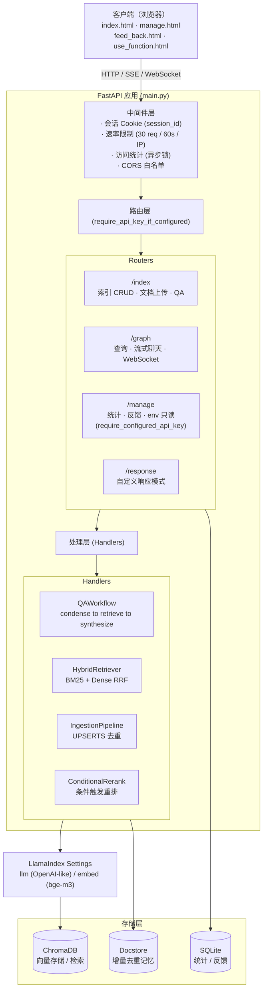
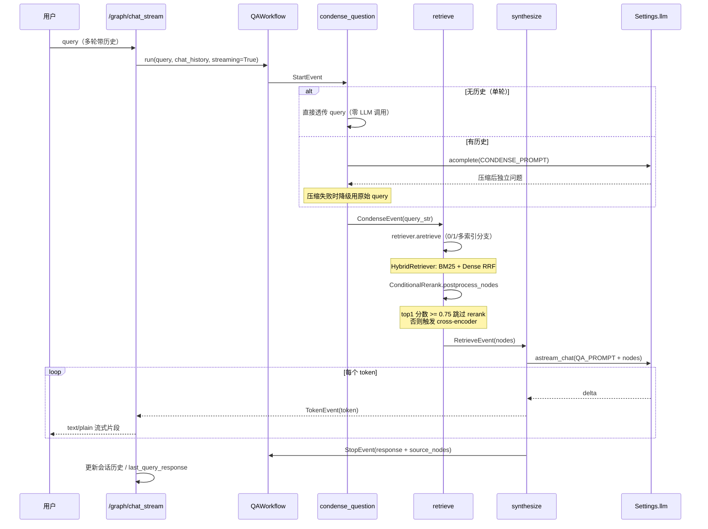
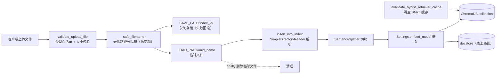
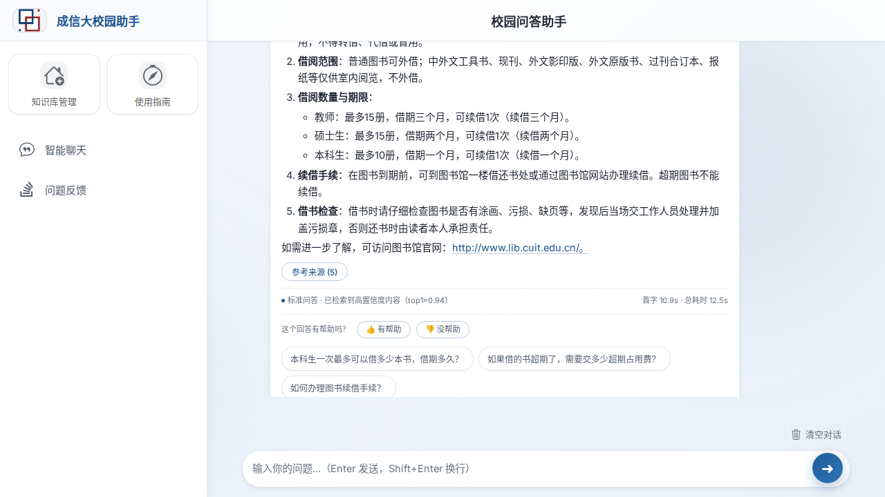
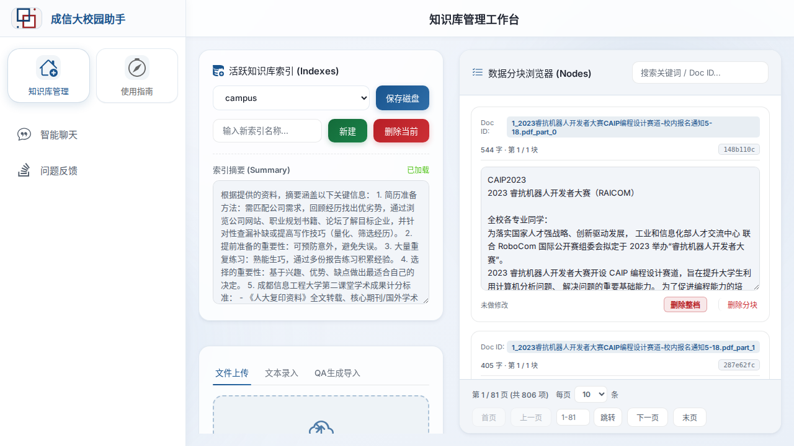
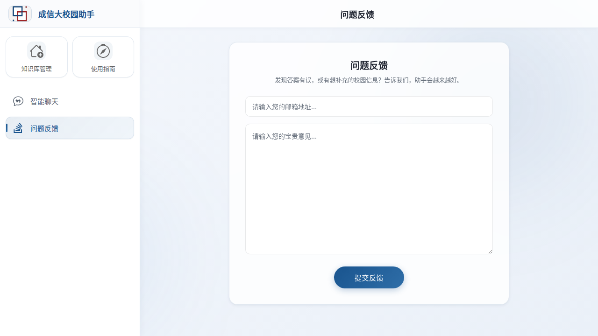
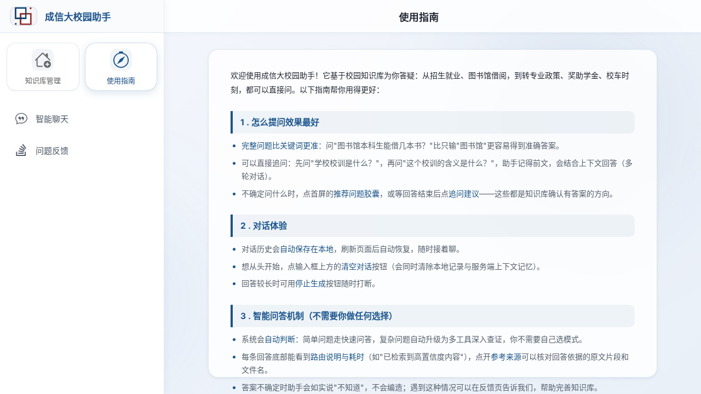

# CUITCCA — 成都信息工程大学校园 AI 助手

> 基于 FastAPI + LlamaIndex + ChromaDB 的校园 RAG 智能问答系统，支持多索引知识库管理、混合检索、条件重排与流式问答。

[](https://github.com/chuanyue98/CUITCCA/actions/workflows/ci.yml)
[](https://github.com/chuanyue98/CUITCCA/actions/workflows/e2e.yml)
[](LICENSE)
[](https://www.python.org/)
[](CONTRIBUTING.md)

---

## 项目介绍

**CUITCCA**（CUIT Campus AI Assistant）是为成都信息工程大学（CUIT）打造的校园智能问答系统，采用 RAG（Retrieval-Augmented Generation）架构，把校园各类公开文档（招生、就业、规章制度、学习资源等）转化为可检索的知识库，让师生用自然语言就能快速获取准确答案，而不是在几十个 PDF 与网页里翻找。

### 解决什么问题

- 校园信息分散在多个部门网站、PDF、Excel 中，检索成本高
- 通用搜索引擎无法理解校园术语与校内政策语境
- 传统关键词搜索无法处理"图书馆怎么借书"这类自然语言追问

### 为什么选择它

- **检索质量有评测护航**：BM25 + Dense RRF 混合检索 + 条件 cross-encoder 重排，每一档都有 golden 集 hit_rate/MRR 评测数据支撑（见 [评测](#评测)）
- **增量摄取不堆垃圾**：上传文档按内容 sha256 去重，重复上传自动跳过、内容变化原地更新，同名跨目录冲突有显式消解策略
- **本地开发友好、生产安全**：CUITCCA_API_KEY 未配置时读写接口自动跳过认证便于本地联调，配置后即强制 Bearer 鉴权
- **可观测性开箱即用**：OpenTelemetry + OpenInference 链路追踪，环境变量门控，零侵入
- **流式体验**：基于 LlamaIndex Workflow 的 token 级流式输出，首字延迟低

### 适用场景

- 校园问答机器人（招生咨询、办事指南、学习资源导航）
- 企业内部知识库问答（替换为本单位语料即可复用）
- RAG 架构参考实现（混合检索 + 条件重排 + 增量摄取的工程范本）

---
## 功能列表

- 📚 **多索引知识库管理** — 创建 / 删除 / 摘要生成 / 节点级增删改
- 📤 **多格式文档上传** — PDF / DOCX / TXT / MD / CSV / XLSX，单文件与批量
- 🔍 **混合检索** — BM25（jieba 分词）+ Dense 向量，RRF 融合，默认开启
- 🎯 **条件重排** — cross-encoder（bge-reranker-v2-m3），仅低置信度时触发，性能与质量兼顾
- 💬 **流式问答** — QAWorkflow 三步（condense → retrieve → synthesize），token 级流式
- 🧠 **多轮对话** — 问题压缩（condense）+ 会话历史（session cookie + TTLCache）
- 🔄 **增量摄取管道** — UPSERTS 去重，同名冲突消解（同目录取新 / 跨目录全保留）
- 📊 **评测框架** — golden 集 + hit_rate/MRR + A/B/C 对比脚本
- 🛡️ **安全防护** — 可选 API Key 认证、速率限制、路径穿越防护、文件白名单、CORS 白名单
- 🔭 **可观测性** — OpenTelemetry + OpenInference，span 树导出，环境变量门控
- 🌙 **暗色模式** — 跟随 prefers-color-scheme，覆盖全部页面
- 💾 **对话持久化** — 浏览器 localStorage，刷新自动恢复

---

## 技术架构

### 技术栈

| 层级 | 技术 |
|------|------|
| 后端框架 | Python 3.12+, FastAPI, Uvicorn |
| AI 框架 | LlamaIndex（Workflow / RetrieverQueryEngine / RouterRetriever） |
| 向量存储 | ChromaDB（PersistentClient） |
| 嵌入模型 | HuggingFace BAAI/bge-m3（本地运行，无需 API key） |
| 重排序 | sentence-transformers BAAI/bge-reranker-v2-m3（约 2.2GB） |
| 混合检索 | bm25s + jieba 分词，RRF 融合（QueryFusionRetriever） |
| 关系存储 | SQLite（访问统计与用户反馈） |
| 前端 | TypeScript, Vite MPA, HTML/CSS（无框架）, marked.js + DOMPurify |
| 包管理 | uv（Python）, npm（前端） |
| 测试 | pytest + pytest-asyncio + pytest-cov, Playwright（E2E） |
| 可观测性 | OpenTelemetry SDK + OpenInference instrumentation |
| CI/CD | GitHub Actions（lint / typecheck / test / coverage / security / e2e / evals） |
### 架构图


### QAWorkflow 时序图


### 数据流图（文档上传）



详细的模块职责、设计决策与数据流分析见 [架构文档](docs/architecture.md)。

---

## 快速开始

### 前置要求

- Python >= 3.12
- [uv](https://github.com/astral-sh/uv) 包管理器
- Node.js >= 18（前端开发可选，生产构建需要）
- 可访问的 OpenAI 兼容 LLM API（或本地部署的等价服务）

### 四步启动

```bash
# 1. 克隆仓库
git clone https://github.com/chuanyue98/CUITCCA.git
cd CUITCCA

# 2. 安装依赖（uv 会自动创建虚拟环境）
uv sync

# 3. 配置环境变量
cp backend/.env.example backend/.env
#   编辑 backend/.env，至少填入 OPENAI_API_KEY

# 4. 启动后端（开发模式，热重载）
make dev
```

启动后访问：

- 前端界面：`http://localhost:8522/web/`
- 交互式 API 文档：`http://localhost:8522/docs`
- ReDoc：`http://localhost:8522/redoc`

> 服务默认监听 `0.0.0.0:8522`，可由 `HOST` / `PORT` 环境变量覆盖。

### 前端开发（可选）

```bash
make frontend-install   # 安装前端依赖
make frontend-dev       # Vite 开发服务器（http://localhost:5173，代理 API 到 8522）
make frontend-build     # 构建生产产物到 backend/app/static/
```

---
## 安装方式

### 源码安装

见 [快速开始](#快速开始)。推荐用 `uv sync` 一键装齐 Python 依赖。

### 启动脚本

仓库附带便捷脚本：

```bash
./backend.bash     # Linux / macOS
backend.bat        # Windows
```

### Docker（社区示例）

仓库未内置 Dockerfile，可参考 [docs/deployment.md](docs/deployment.md) 中的示例 Dockerfile 自行构建。Roadmap 计划提供官方镜像。

### systemd

生产部署推荐 systemd 托管，单元文件模板见 [docs/deployment.md](docs/deployment.md)。

---

## 配置说明

所有配置通过 `backend/.env` 注入（模板见 `backend/.env.example`）。配置项按用途分组如下。

### 基础配置

| 变量 | 默认值 | 说明 |
|------|--------|------|
| `OPENAI_API_KEY` | （必填） | LLM API 密钥 |
| `OPENAI_API_BASE` | `https://api.openai.com/v1` | OpenAI 兼容 API 地址 |
| `OPENAI_MODEL` | `sensenova-6.7-flash-lite` | 使用的 chat 模型名 |
| `HOST` | `0.0.0.0` | 服务绑定地址 |
| `PORT` | `8522` | 服务端口 |
| `VERBOSE` | `False` | 详细日志输出 |

### 检索配置

| 变量 | 默认值 | 说明 |
|------|--------|------|
| `SIMILARITY_TOP_K` | `5` | 主查询路径默认 top_k |
| `QUERY_ENDPOINT_TOP_K` | `2` | `/index/{name}/query` 专用 top_k |
| `MULTI_INDEX_FALLBACK_TOP_K` | `3` | 多索引回退 top_k |
| `HYBRID_RETRIEVAL_ENABLED` | `True` | 混合检索开关（BM25 + Dense RRF） |
| `RERANK_ENABLED` | `True` | 条件触发式 rerank 开关 |
| `RERANK_RECALL_K` | `20` | Rerank 候选召回数 |
| `RERANK_TOP_N` | `5` | Rerank 后保留 top N |
| `RERANK_SCORE_THRESHOLD` | `0.75` | top1 分数 >= 此值时跳过 rerank |
| `RERANKER_MODEL` | `BAAI/bge-reranker-v2-m3` | cross-encoder 模型 |

### 存储路径配置

> 路径相对 `backend/app/` 解析。

| 变量 | 默认值 | 说明 |
|------|--------|------|
| `INDEX_SAVE_DIRECTORY` | `../../data/indexes/` | 索引持久化目录 |
| `SAVE_PATH` | `../../data/upload_files` | 上传文件永久存储 |
| `LOAD_PATH` | `../../data/temp/` | 上传临时目录 |
| `CHROMA_DB_PATH` | `../../data/chroma_db/` | ChromaDB 数据目录 |
| `DB_PATH` | `../../data/app.db` | SQLite 数据库路径 |

### 安全配置

| 变量 | 默认值 | 说明 |
|------|--------|------|
| `CUITCCA_API_KEY` | （空） | 管理接口认证密钥；未配置时 `/index` `/graph` `/response` 跳过认证便于本地开发，`/manage` 返回 503 |
| `COOKIE_SECURE` | `False` | Cookie Secure 标志（HTTPS 下应设 `True`） |
| `COOKIE_MAX_AGE` | `86400` | Cookie 有效期（秒） |
| `CORS_ORIGINS` | localhost 系列 | 允许的 CORS 源（逗号分隔） |

### 可观测性配置

| 变量 | 默认值 | 说明 |
|------|--------|------|
| `CUITCCA_TRACING_ENABLED` | （空） | 显式开启链路追踪 |
| `OTEL_EXPORTER_OTLP_ENDPOINT` | （空） | OTLP HTTP endpoint，设置即视为开启 |
| `OTEL_SERVICE_NAME` | `cuitcca` | service.name |

详见 [docs/observability.md](docs/observability.md)。

---
## API 文档

完整端点说明见 [docs/api.md](docs/api.md)，运行时交互式文档在 `/docs` 与 `/redoc`。所有路由组均挂载 `require_api_key_if_configured` 依赖：**未配置 `CUITCCA_API_KEY` 时跳过认证（便于本地开发），配置后强制 Bearer 鉴权**；`/manage` 组使用更严格的 `require_configured_api_key`（未配置直接 503）。

### `/index` — 索引与文档管理

`GET /index/` · `GET /index/list` · `POST /index/create` · `POST /index/delete` ·
`GET /index/{name}/info` · `POST /index/{name}/query` ·
`POST /index/{name}/uploadFile` · `POST /index/{name}/uploadFiles` ·
`POST /index/{name}/upload_file_by_QA` · `POST /index/{name}/insertdoc` ·
`POST /index/{name}/update` · `POST /index/{name}/deleteDoc` · `POST /index/{name}/deleteNode` ·
`GET /index/{name}/get_summary` · `POST /index/{name}/set_summary` · `POST /index/{name}/generate_summary` ·
`POST /index/{name}/getfile` · `POST /index/{name}/evaluator` · `POST /index/{name}/save`

### `/graph` — 查询与聊天

`POST /graph/query` · `POST /graph/query_stream`（SSE 流式） · `POST /graph/chat_stream`（多轮流式） ·
`POST /graph/workflow_query` · `POST /graph/workflow_query_stream` ·
`POST /graph/query_sources` · `POST /graph/query_history` · `POST /graph/create` ·
`POST /graph/agent` · `POST /graph/query_router` · `WS /graph/query`（需 API Key）

### `/manage` — 管理接口（严格鉴权）

`GET /manage/stats` · `POST /manage/feedback` · `GET /manage/feedback` · `GET /manage/env`（**只读脱敏**，已移除在线修改能力）

### `/response` — 自定义响应模式

`POST /response/{name}/query`（按 `ResponseMode` + `PromptType` 合成）

---

## 使用示例

> 以下示例假设服务运行在 `http://localhost:8522`，且**未配置** `CUITCCA_API_KEY`（本地开发默认）。配置后请在请求头加 `Authorization: Bearer <CUITCCA_API_KEY>`。

### 创建索引

```bash
curl -X POST http://localhost:8522/index/create \
  -d "index_name=campus"
```

### 上传文件

```bash
# 单文件
curl -X POST http://localhost:8522/index/campus/uploadFile \
  -F "file=@/path/to/招生简章.pdf"

# 批量
curl -X POST http://localhost:8522/index/campus/uploadFiles \
  -F "files=@a.pdf" -F "files=@b.docx"
```

### 非流式问答

```bash
curl -X POST http://localhost:8522/graph/query \
  -d "query=图书馆怎么借书？"
# => {"response": "..."}
```

### 流式问答（SSE）

```bash
curl -N -X POST http://localhost:8522/graph/chat_stream \
  -d "query=学校有哪些社团？"
# => 逐 token 返回 text/plain 片段
```

### 获取参考来源

```bash
curl -X POST http://localhost:8522/graph/query_sources
# => {"source_nodes": [{"id":"...","text":"...","score":0.85}]}
```

---
## 部署方式

### Docker

参考 [docs/deployment.md](docs/deployment.md) 中的示例 Dockerfile。生产环境务必：

- 配置强随机的 `CUITCCA_API_KEY`
- 设置 `COOKIE_SECURE=true`（HTTPS 下）
- 用 `CORS_ORIGINS` 限制允许的源

### systemd

单元文件模板与启用步骤见 [docs/deployment.md](docs/deployment.md)。

### Nginx 反向代理

```nginx
server {
    listen 80;
    server_name cuitcca.example.com;
    client_max_body_size 50M;
    location / {
        proxy_pass http://127.0.0.1:8522;
        proxy_set_header Host $host;
        proxy_set_header X-Real-IP $remote_addr;
    }
}
```

完整说明（含 Chroma 持久化备份、生产加固清单）见 [docs/deployment.md](docs/deployment.md)。

---

## 开发指南

常用命令（`Makefile`）：

```bash
make dev               # 开发服务器（热重载）
make run               # 生产服务器
make test              # pytest 测试
make lint              # ruff 代码风格检查
make typecheck         # mypy 类型检查
make security          # pip-audit + bandit 安全扫描
make format            # 自动格式化
make clean             # 清理缓存
make frontend-install  # 安装前端依赖
make frontend-dev      # 前端开发服务器
make frontend-build    # 构建前端到 backend/app/static/
```

代码规范与提交流程见 [CONTRIBUTING.md](CONTRIBUTING.md)，本地开发细节（含前端调试、E2E）见 [docs/development.md](docs/development.md)。

- **行宽限制**：120 字符
- **Python 版本**：3.12+（CI 矩阵覆盖 3.12 / 3.13）
- 提交 PR 前建议跑：`make lint typecheck test`

---

## 测试

### 后端测试

```bash
make test                                          # 全量测试
uv run pytest tests/ -v --cov=backend/app          # 带覆盖率
uv run pytest tests/ -m "not eval"                 # 跳过评测类测试
uv run pytest tests/test_hybrid_retriever.py -v    # 单文件
```

- 测试规模：**300+ 用例，覆盖率 94%+**（CI 强制 `fail_under=90`）
- 覆盖索引 CRUD、混合检索、QAWorkflow、增量摄取、认证中间件、上传校验、可观测性等

### 前端测试

- **类型检查**：`cd frontend && npx tsc --noEmit`（CI 已接入）
- **E2E 测试**：Playwright，位于 `tests/playwright/`，见 [开发指南文档](docs/development.md)

> 前端单元测试（vitest）已列入 Roadmap，当前以 TypeScript 类型检查 + Playwright E2E 兜底。

### E2E（Playwright）

```bash
cd tests/playwright && npm ci
npx playwright install --with-deps chromium
npx playwright test                 # 需后端运行于 8522
```

CI 中 E2E 流水线（`.github/workflows/e2e.yml`）会在配置了 `OPENAI_API_KEY` secret 时跑真实问答 spec，未配置则跳过真实问答、仅跑 UI 结构/交互用例。

---
## 评测

检索质量评测框架位于 `evals/`，golden 集 + hit_rate/MRR + A/B/C 对比。完整说明见 [evals/README.md](evals/README.md)。

```bash
uv run python evals/ingest_corpus.py                  # 导入评测语料
uv run python evals/run_retrieval_eval.py             # 检索基线
uv run python evals/run_hybrid_eval.py                # 混合检索 A/B/C
uv run python evals/run_rerank_eval.py                # Rerank A/B
uv run python evals/run_workflow_retrieval_eval.py    # Workflow 检索
```

关键结论（`campus-corpus`，详见 evals/README.md）：

| 指标 | 纯向量基线 | + 混合检索 | + 混合 + rerank |
|------|-----------|-----------|----------------|
| hit_rate@1 | 75% | 85% | **90%** |
| MRR@5 | 0.852 | 0.896 | **0.910** |
| 平均延迟 | 13ms | +2ms | +660ms（仅低置信度触发） |

---

## Demo 截图

> 截图由维护者本地运行 `scripts/take_screenshots.py` 生成，未生成前为占位图。









生成截图：

```bash
# 前置：后端已运行于 localhost:8522（make dev）
pip install playwright && playwright install chromium
uv run python scripts/take_screenshots.py
# 截图输出到 docs/screenshots/
```

脚本支持 `--base-url` 与 `--output-dir` 参数，详见 `scripts/take_screenshots.py` 顶部 docstring。

---

## Roadmap

### v0.4.0（计划中）

- 前端组件化重构（当前为原生 TS，无框架）
- 官方 Docker 镜像与 docker-compose 一键部署
- 多语言界面（i18n）
- Agent 工具调用（接入 MCP 工具，替换 QAWorkflow `synthesize` step 中的工具选择钩子）
- 前端 vitest 单元测试接入

### v1.0 目标

- 检索质量稳定达标（hit_rate@1 >= 95%）
- 多模态文档支持（图片 / 扫描件 OCR）
- 完整管理员后台（统计可视化、反馈看板）
- 生产级可观测性仪表盘

---
## 贡献

欢迎贡献！请先阅读 [CONTRIBUTING.md](CONTRIBUTING.md) 了解开发环境搭建、代码规范与提交流程。

- Bug 与功能建议：[GitHub Issues](https://github.com/chuanyue98/CUITCCA/issues)
- PR 前请确保 `make lint typecheck test` 通过

---

## 安全

发现安全漏洞请勿公开提 Issue，请私下联系维护者。当前已内置的防护见 [配置说明-安全配置](#安全配置)。

---

## 许可证

[MIT License](LICENSE) © CUITCCA 维护者

---

## 致谢

- [LlamaIndex](https://github.com/run-llama/llama_index) — RAG 框架与 Workflow 原语
- [ChromaDB](https://www.trychroma.com/) — 开源向量数据库
- [FastAPI](https://fastapi.tiangolo.com/) — 高性能 Python Web 框架
- [bm25s](https://github.com/xhluca/bm25s) 与 [jieba](https://github.com/fxsjy/jieba) — 中文 BM25 检索
- [sentence-transformers](https://www.sbert.net/) — cross-encoder 重排
- [OpenInference](https://github.com/Arize-ai/openinference) — LLM 链路追踪
- 成都信息工程大学（CUIT）师生提供的真实语料与反馈