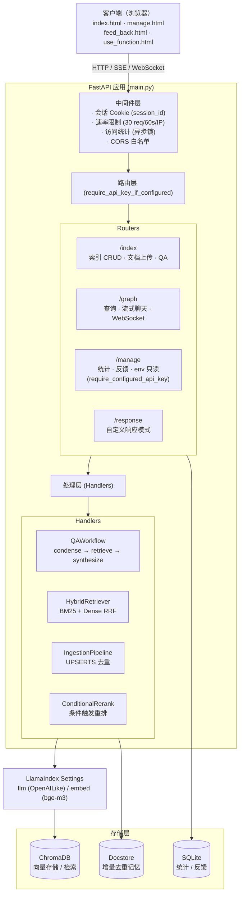
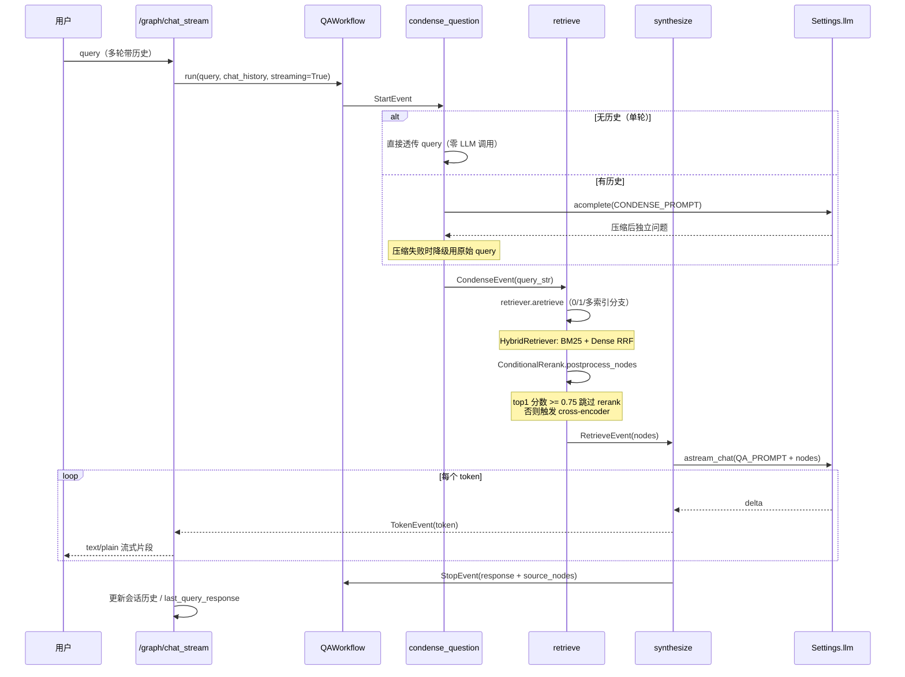
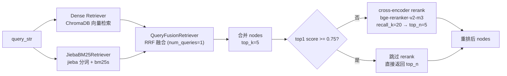
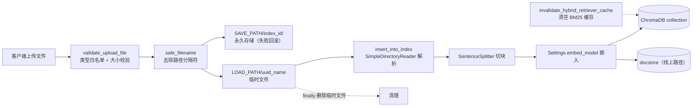
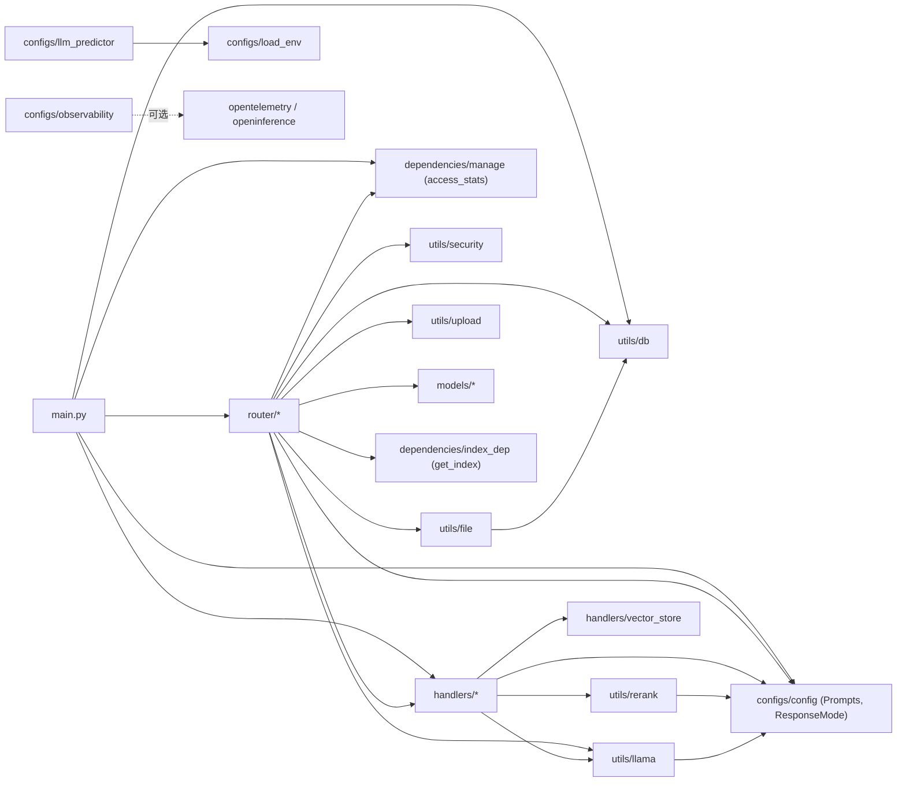

# CUITCCA Code Wiki

> 结构化的代码知识库文档：覆盖项目整体架构、模块职责、关键类与函数、依赖关系、运行方式与质量保障。
> 与 [README](../README.md) 和 [架构文档](architecture.md) 互补：README 面向使用者，架构文档面向设计者，本文档面向维护者。

---

## 目录

- [1. 项目概览](#1-项目概览)
- [2. 技术栈与依赖](#2-技术栈与依赖)
- [3. 目录结构](#3-目录结构)
- [4. 系统整体架构](#4-系统整体架构)
- [5. 后端模块详解](#5-后端模块详解)
  - [5.1 应用入口 `app/main.py`](#51-应用入口-appmainpy)
  - [5.2 配置层 `app/configs/`](#52-配置层-appconfigs)
  - [5.3 路由层 `app/router/`](#53-路由层-approuter)
  - [5.4 处理层 `app/handlers/`](#54-处理层-apphandlers)
  - [5.5 工具层 `app/utils/`](#55-工具层-apputils)
  - [5.6 数据模型 `app/models/`](#56-数据模型-appmodels)
  - [5.7 依赖注入 `app/dependencies/`](#57-依赖注入-appdependencies)
  - [5.8 异常处理 `app/exceptions/`](#58-异常处理-appexceptions)
- [6. 前端模块详解](#6-前端模块详解)
- [7. 测试与评测体系](#7-测试与评测体系)
- [8. CI/CD 与脚本](#8-cicd-与脚本)
- [9. 关键运行流程](#9-关键运行流程)
- [10. 项目运行方式](#10-项目运行方式)
- [11. 关键设计决策](#11-关键设计决策)
- [12. 安全与可观测性](#12-安全与可观测性)

---

## 1. 项目概览

**CUITCCA**（CUIT Campus AI Assistant）是为成都信息工程大学（CUIT）打造的校园智能问答系统，采用 **RAG（Retrieval-Augmented Generation）架构**。

### 解决什么问题

- 校园信息分散在多个部门网站、PDF、Excel 中，检索成本高
- 通用搜索引擎无法理解校园术语与校内政策语境
- 传统关键词搜索无法处理"图书馆怎么借书"这类自然语言追问

### 核心能力

| 能力 | 实现要点 |
|------|---------|
| 多索引知识库管理 | 创建 / 删除 / 摘要生成 / 节点级增删改 |
| 多格式文档上传 | PDF / DOCX / TXT / MD / CSV / XLSX |
| 混合检索 | BM25（jieba 分词）+ Dense 向量，RRF 融合 |
| 条件重排 | cross-encoder（bge-reranker-v2-m3），仅低置信度时触发 |
| 流式问答 | LlamaIndex Workflow 三步（condense → retrieve → synthesize） |
| 多轮对话 | 问题压缩 + 会话历史（session cookie + TTLCache） |
| 增量摄取 | UPSERTS 去重，sha256 doc_id，同名冲突消解 |
| 评测框架 | golden 集 + hit_rate/MRR + A/B/C 对比脚本 |
| 安全防护 | 双层级 API Key 认证、速率限制、路径穿越防护、CORS 白名单 |
| 可观测性 | OpenTelemetry + OpenInference，环境变量门控，零侵入 |

### 仓库元数据

- **名称**: `cuitcca`，版本 `0.2.0`
- **协议**: MIT
- **Python**: 3.12+（CI 矩阵覆盖 3.12 / 3.13）
- **包管理**: `uv`（Python）、`npm`（前端）
- **仓库主页**: https://github.com/ChuanYuei/CUITCCA

---

## 2. 技术栈与依赖

### 后端依赖（来自 [pyproject.toml](../pyproject.toml)）

| 类别 | 包 | 用途 |
|------|----|------|
| Web 框架 | `fastapi`>=0.139.0, `uvicorn`>=0.50.2, `python-multipart`>=0.0.32, `python-dotenv`>=1.1.0 | HTTP 服务、表单解析、env 加载 |
| 数据建模 | `pydantic[email]`>=2.9.0 | Pydantic v2 schema + EmailStr |
| 异步 I/O | `aiofiles`>=24.1.1 | 异步文件读写 |
| LLM 框架 | `llama-index-core`>=0.14.23, `llama-index-embeddings-huggingface`>=0.5.0, `llama-index-llms-openai-like`>=0.4.0, `llama-index-vector-stores-chroma`>=0.3.0, `llama-index-readers-file`>=0.6.0 | RAG 框架核心 |
| 向量存储 | `chromadb`>=0.6.0,<2.0 | PersistentClient 向量库 |
| OpenAI 客户端 | `openai`>=2.45.0, `tiktoken`>=0.13.0 | OpenAI 兼容 API + tokenizer |
| 中文检索 | `jieba`>=0.42.1, `bm25s`>=0.3.9 | 中文分词 + BM25 稀疏检索 |
| 重排 | `sentence-transformers`>=3.0 | bge-reranker-v2-m3 cross-encoder |
| 文档解析 | `pdfplumber`>=0.11.10, `python-docx`>=1.1.0, `docx2txt`>=0.8, `openpyxl`>=3.1, `xlrd`>=2.0.2, `XlsxWriter`>=3.2.9 | PDF/DOCX/XLSX 解析 |
| 数据处理 | `pandas`>=2.2.3, `networkx`>=3.6.1, `orjson`>=3.11.9, `PyYAML`>=6.0.3, `tqdm`>=4.68.3 | DataFrame、图、JSON、YAML、进度 |
| 模型层 | `transformers`==5.14.1, `nltk`==3.10.0 | 模型底层依赖 |
| 可观测性 | `openinference-instrumentation-llama-index`>=3.0, `opentelemetry-sdk`>=1.20, `opentelemetry-exporter-otlp-proto-http`>=1.20 | OTel 链路追踪 |

### 开发依赖

`pytest`, `pytest-cov`, `pytest-asyncio`, `ruff`, `mypy`, `pip-audit`, `bandit`

### 前端依赖（[frontend/package.json](../frontend/package.json)）

仅 `devDependencies`：`typescript`^7.0.2, `vite`^8.1.5, `@types/node`^26.1.1, `vitest`^4.1.10, `@vitest/coverage-v8`^4.1.10, `happy-dom`^20.11.1。
Markdown 渲染与 XSS 防护使用 vendored 的 `marked.min.js` / `purify.min.js`（无 npm 依赖）。

---

## 3. 目录结构

```
CUITCCA/
├── backend/
│   ├── app/
│   │   ├── configs/         # 配置与初始化（load_env / llm_predictor / observability / config 提示词）
│   │   ├── dependencies/    # FastAPI Depends（index 解析、access_stats 锁）
│   │   ├── exceptions/      # 装饰器：id_not_found_exceptions
│   │   ├── handlers/        # 业务核心（QAWorkflow / HybridRetriever / IngestionPipeline / index_crud / vector_store / graph_builder / llama_handler）
│   │   ├── models/          # Pydantic schema（response / user）
│   │   ├── router/          # 4 个路由组（index / graph / manage / response）
│   │   ├── utils/           # 工具（security / file / upload / db / llama / rerank / logger）
│   │   ├── main.py          # FastAPI 应用入口
│   │   └── static/          # 前端构建产物（由 make frontend-build 写入）
│   └── .env.example         # 环境变量模板
├── frontend/
│   ├── src/
│   │   ├── utils/           # api.ts / dom.ts / toast.ts
│   │   ├── chat.ts          # 聊天页（流式 + localStorage）
│   │   ├── manage.ts        # 知识库管理页
│   │   ├── sidebar.ts       # 共享侧边栏
│   │   ├── feed_back.ts     # 反馈页
│   │   └── global.d.ts
│   ├── vendor/              # marked.min.js / purify.min.js
│   ├── *.html               # 4 个 MPA 入口
│   ├── style.css            # 全局样式 + 暗色模式
│   ├── vite.config.ts
│   └── tsconfig.json
├── tests/                   # pytest（40+ 测试文件） + playwright/（E2E）
├── evals/                   # 检索质量评测
├── scripts/                 # ingest_cori_online.py / take_screenshots.py
├── docs/                    # 文档（api / architecture / deployment / development / observability / troubleshooting）
├── .github/workflows/       # ci / e2e / evals / release
├── Makefile                 # 开发命令封装
├── pyproject.toml           # Python 项目与工具配置
└── uv.lock                  # uv 锁文件
```

---

## 4. 系统整体架构

CUITCCA 采用 **6 层分层架构**，从外到内依次为：

```
客户端 → (Nginx 反向代理生产) → FastAPI 中间件层 → 路由层 → 处理层 → LlamaIndex 抽象层 → 存储层
```

### 分层职责

1. **中间件层**（`main.py`）：会话 Cookie 管理、速率限制（30 req/60s/IP）、访问统计（异步锁 + 定期刷盘）、CORS 白名单。生命周期由 FastAPI `lifespan` 管理。
2. **路由层**（`router/`）：四个路由组（`/index`、`/graph`、`/manage`、`/response`），统一挂载 `require_api_key_if_configured` 依赖。
3. **处理层**（`handlers/`）：核心业务逻辑。`QAWorkflow` 负责三步问答，`HybridRetriever` 负责混合检索，`IngestionPipeline` 负责增量摄取，`ConditionalRerankPostprocessor` 负责条件重排。
4. **LlamaIndex 抽象层**：`Settings.llm`（OpenAILike）与 `Settings.embed_model`（bge-m3）为全局单例。
5. **存储层**：ChromaDB（向量）、SQLite（统计/反馈）、SimpleDocumentStore（增量去重记忆）。

### 架构图



---

## 5. 后端模块详解

### 5.1 应用入口 `app/main.py`

[main.py](../backend/app/main.py) — FastAPI 应用与运行时基础设施。**212 行**。

#### 核心符号

| 符号 | 签名 | 行为 |
|------|------|------|
| `app` | `FastAPI` 实例 | `FastAPI(lifespan=lifespan)`，无 title/version 覆盖 |
| `lifespan` | `async contextmanager lifespan(app)` | 启动钩子与停止钩子的统一入口 |
| `RATE_LIMIT_WINDOW` | `int = 60` | 每 IP 速率限制时间窗（秒） |
| `RATE_LIMIT_MAX_REQUESTS` | `int = 30` | 每 IP 每窗口最大 LLM 查询请求数 |
| `RATE_LIMIT_STORE_MAX` | `int = 5000` | 速率限制存储上限 |
| `check_rate_limit` | `async (client_ip: str) -> None` | 超限抛 `HTTPException(429)` |
| `session_and_stats_middleware` | `async (request, call_next)` | 会话 Cookie + 访问统计 + 速率限制门控 |
| `read_root` | `() -> dict` | `GET /` → `{"Hello": "CUITCCA"}` |
| `_periodic_flush` | `async ()` | 每 60s 把访问统计刷到 SQLite |
| `_periodic_rate_limit_cleanup` | `async ()` | 每 30s 清理过期速率限制条目 |
| `_evict_expired_rate_limits` | `() -> None` | 剪枝 `_rate_limit_store` |

#### Lifespan 启动序列

```
1. reload_env_variables()              # 重新加载 .env
2. init_observability()                # OTel/OpenInference（默认 no-op）
3. init_settings()                     # 配置 Settings.llm / embed_model / text_splitter
4. await loadAllIndexes()              # 加载所有索引
5. os.makedirs(SAVE_PATH, LOAD_PATH, chroma_db_path)
6. os.makedirs(dirname(db_path))
7. await asyncio.to_thread(stats_db.init_db, db_path)
8. await asyncio.to_thread(stats_db.load_stats, db_path)
9. spawn _periodic_flush task
10. spawn _periodic_rate_limit_cleanup task
11. yield                             # 服务请求
```

#### Lifespan 停止序列

1. 取消两个后台任务，吞掉 `asyncio.CancelledError`
2. 在 `access_stats_lock` 下取最终快照，`asyncio.to_thread(stats_db.flush_stats, db_path, final_snapshot)` 写盘

#### 中间件注册顺序

1. **`session_and_stats_middleware`**（`@app.middleware("http")`）：检测 `/web` 静态路径、解析 `client_ip`、读写 `session_id` cookie、对 LLM 查询端点跑 `check_rate_limit`、累加 `access_stats`、为新会话设置 cookie。
2. **`CORSMiddleware`**（`app.add_middleware`）：origins 来自 `CORS_ORIGINS`，默认 localhost 系列；`allow_credentials=False`、`methods=["GET","POST"]`、`headers=["Content-Type","Authorization"]`。

> Starlette 在请求入站时按反向注册顺序应用中间件，所以 CORS 先跑，再跑 `session_and_stats_middleware`。

#### 路由挂载

| 前缀 | Tags | Router | 鉴权 |
|------|------|--------|------|
| `/index` | `['index']` | `index_app` | 在 router 内挂 `Depends(require_api_key_if_configured)` |
| `/graph` | `['graph']` | `graph_app` | 同上 |
| `/response` | `['response']` | `response_app` | 同上 |
| `/manage` | `['manage']` | `manage_app` | 端点级 `Depends(require_configured_api_key)`（fail-closed） |

#### 静态文件挂载

- `static_dir = backend/app/static`（优先）→ `app.mount("/web", StaticFiles(directory=static_dir, html=True))`
- 否则回退到 `frontend/` 目录
- 都不存在则不挂载 `/web`

#### `__main__`

`HOST`（默认 `0.0.0.0`）+ `PORT`（默认 `8522`），`uvicorn.run('main:app', reload=False)`。

---

### 5.2 配置层 `app/configs/`

#### `load_env.py` — 环境变量加载与热重载（117 行）

**所有路径与开关常量都集中在此文件**，不是 `config.py`。

| 常量 | 类型 | 默认 | 来源 env | 用途 |
|------|------|------|----------|------|
| `PROJECT_ROOT` | str | `backend/app` | 计算（不重载） | 所有相对路径的基址 |
| `index_save_directory` | str | `../../data/indexes/` | `INDEX_SAVE_DIRECTORY` | 索引持久化目录 |
| `SAVE_PATH` | str | `../../data/upload_files` | `SAVE_PATH` | 上传文件永久存储 |
| `LOAD_PATH` | str | `../../data/temp/` | `LOAD_PATH` | 上传临时目录 |
| `FEEDBACK_PATH` | str | `../../feedback/` | `FEEDBACK_PATH` | 反馈存储 |
| `LOG_PATH` | str | `../../log/` | `LOG_PATH` | 日志目录 |
| `FILE_PATH` | str | `../../data/export/` | `FILE_PATH` | 导出文件目录 |
| `chroma_db_path` | str | `../../data/chroma_db/` | `CHROMA_DB_PATH` | ChromaDB 数据目录 |
| `db_path` | str | `../../data/app.db` | `DB_PATH` | SQLite 路径 |
| `openai_api_key` | str\|None | `''` | `OPENAI_API_KEY` | LLM API 密钥（缺失时打 warning） |
| `openai_api_base` | str | `https://api.openai.com/v1` | `OPENAI_API_BASE` | OpenAI 兼容 API 地址 |
| `openai_model` | str | `sensenova-6.7-flash-lite` | `OPENAI_MODEL` | chat 模型名 |
| `VERBOSE` | bool | `False` | `VERBOSE` | 详细日志 |
| `COOKIE_SECURE` | bool | `False` | `COOKIE_SECURE` | Cookie Secure 标志 |
| `COOKIE_MAX_AGE` | int | `86400` | `COOKIE_MAX_AGE` | Cookie 有效期（秒） |
| `DEFAULT_SIMILARITY_TOP_K` | int | `5` | `SIMILARITY_TOP_K` | 主查询路径 top_k |
| `QUERY_ENDPOINT_TOP_K` | int | `2` | `QUERY_ENDPOINT_TOP_K` | `/index/{name}/query` 专用 top_k |
| `MULTI_INDEX_FALLBACK_TOP_K` | int | `3` | `MULTI_INDEX_FALLBACK_TOP_K` | 多索引回退 top_k |
| `HYBRID_RETRIEVAL_ENABLED` | bool | `True` | `HYBRID_RETRIEVAL_ENABLED` | 混合检索开关 |
| `RERANK_ENABLED` | bool | `True` | `RERANK_ENABLED` | 条件重排开关 |
| `RERANK_RECALL_K` | int | `20` | `RERANK_RECALL_K` | Rerank 候选召回数 |
| `RERANK_TOP_N` | int | `5` | `RERANK_TOP_N` | Rerank 后保留数 |
| `RERANK_SCORE_THRESHOLD` | float | `0.75` | `RERANK_SCORE_THRESHOLD` | 触发 rerank 的阈值 |
| `RERANKER_MODEL` | str | `BAAI/bge-reranker-v2-m3` | `RERANKER_MODEL` | cross-encoder 模型 |
| `MAX_FILE_SIZE` | int | `10485760`（10 MiB） | — | 上传文件大小上限 |
| `ALLOWED_EXTENSIONS` | set[str] | `{.pdf,.docx,.txt,.md,.csv,.xlsx}` | — | 上传扩展名白名单 |

**关键函数**

- `reload_env_variables() -> None`：调用 `load_dotenv(<backend>/.env, override=True)` 强制覆盖，再用 `global` 声明重绑所有模块常量。
  - 调用点：(1) 本模块 import 时（line 117）；(2) `main.lifespan` 启动第一步。
  - **热重载惯用法**：消费方应使用 `import configs.load_env as load_env` + `load_env.X` 属性访问，而非 `from configs.load_env import X`，否则 `reload_env_variables()` 的更新不可见。`qa_workflow`、`hybrid_retriever`、`vector_store` 均遵循此惯用法；`index_crud` 部分使用 `from ... import`，是已知限制。

#### `config.py` — 提示词模板与响应模式枚举（86 行）

> 注：尽管文件名暗示"配置"，这里**只放 prompt 模板与 enum**，不放 env 常量。

| 符号 | 类型 | 值 / 行为 |
|------|------|-----------|
| `ResponseMode(str, Enum)` | enum | `COMPACT`, `REFINE`, `SIMPLE_SUMMARIZE`, `TREE_SUMMARIZE`, `GENERATION`, `NO_TEXT`, `ACCUMULATE`, `COMPACT_ACCUMULATE`（镜像 LlamaIndex 响应合成策略） |
| `PromptType(str, Enum)` | enum | `QA_PROMPT`, `CONDENSE_QUESTION_PROMPT` |
| `Prompts(Enum)` | enum | `QA_PROMPT`（CUIT 校园助手系统提示词）、`CONDENSE_QUESTION_PROMPT`（多轮问题压缩）、`REFINE_PROMPT`（基于新上下文更新已有答案） — 都是 `PromptTemplate` |

#### `llm_predictor.py` — LLM 与嵌入初始化（55 行）

| 符号 | 签名 | 行为 |
|------|------|------|
| `build_llm()` | `-> OpenAILike` | 构造 OpenAI 兼容 LLM 客户端；按 `env_config.openai_model/api_key/api_base`；`is_chat_model=True`；`is_function_calling_model` 由 `_FUNCTION_CALLING_MODELS` 决定；`context_window` 来自 `_CONTEXT_WINDOWS`（默认 32768）；`max_tokens=4096` |
| `init_settings()` | `-> None` | 幂等填充 `Settings.embed_model`（HuggingFace `BAAI/bge-m3`，device 跟随 CUDA 可用性，`normalize=True`）、`Settings.llm`（`build_llm()`）、`Settings.text_splitter`（`SentenceSplitter.from_defaults(chunk_size=512)`） |

**私有常量**

- `_CONTEXT_WINDOWS = {'sensenova-6.7-flash-lite': 262144, 'deepseek-v4-flash': 1048576, 'glm-5.2': 1048576, 'sensenova-u1-fast': 262144}`
- `_FUNCTION_CALLING_MODELS = frozenset({'deepseek-v4-flash', 'glm-5.2'})`
- `_DEFAULT_CONTEXT_WINDOW = 32768`, `_MAX_TOKENS = 4096`

> bge-m3 本地运行无需 API key，首次启动下载约 2GB。

#### `observability.py` — OTel/OpenInference（93 行）

| 符号 | 签名 | 行为 |
|------|------|------|
| `init_observability(span_exporter=None)` | `-> bool` | 初始化 LlamaIndex 追踪；返回是否启用。**默认为纯 no-op**（不 import otel 包） |
| `shutdown_observability()` | `-> None` | `_instrumentor.uninstrument()`，重置全局状态（主要用于测试） |

**Gate 条件**：当 `_instrumentor is None` 且 `span_exporter is None` 且 `_tracing_enabled()` 为 False（即 `CUITCCA_TRACING_ENABLED` 非真值 且 `OTEL_EXPORTER_OTLP_ENDPOINT` 未设）时，仅打 debug 日志后返回 False，**零开销**。

**启用时**：用 `openinference.instrumentation.llama_index.LlamaIndexInstrumentor`，导出器为 `OTLPSpanExporter`（HTTP），endpoint 默认 `http://localhost:6006/v1/traces`（本地 Phoenix）；`BatchSpanProcessor` 异步批处理，测试路径用 `SimpleSpanProcessor` 同步；service.name 来自 `OTEL_SERVICE_NAME`（默认 `cuitcca`）。

---

### 5.3 路由层 `app/router/`

四个路由组全部走 `Depends(require_api_key_if_configured)`，`/manage` 额外用 `Depends(require_configured_api_key)`。

#### `index.py` — 索引与文档管理（317 行）

模块级：`index_app = APIRouter(dependencies=[Depends(require_api_key_if_configured)])`。
本地辅助：`_sanitize_index_name(name)` —— 把非 `[\w\-]` 字符替换为 `_`。

| 分组 | 端点 |
|------|------|
| **索引 CRUD** | `GET /` 健康检查 · `GET /list` 列出索引 · `POST /create` 创建（去重检查 + 缓存失效） · `GET /{name}/info` 文档列表 · `POST /delete` 删除（404 if absent） |
| **文件上传** | `POST /{name}/uploadFile` 单文件（永久 + 临时存储，失败回滚，`skip_summary=True`） · `POST /{name}/uploadFiles` 批量（一次 summary + save） · `POST /{name}/upload_file_by_QA` QA 对注入 |
| **节点 CRUD** | `POST /{name}/update` 节点文本更新 · `POST /{name}/deleteDoc` 按 doc_id 删 · `POST /{name}/deleteNode` 按 node_id 删 · `POST /{name}/insertdoc` 插入文本节点（持 per-index 锁 + `asyncio.to_thread`） |
| **摘要** | `GET /{name}/get_summary` 读 · `POST /{name}/set_summary` 写 + saveIndex · `POST /{name}/generate_summary` 调用 `summary_index` 生成 + saveIndex |
| **查询/导出** | `POST /{name}/query` 构 `RetrieverQueryEngine` 用 `QUERY_ENDPOINT_TOP_K` · `POST /{name}/save` saveIndex · `POST /{name}/getfile` 导出索引到 txt · `POST /{name}/evaluator` `ResponseEvaluator` 评估 |

**所有写操作**都会调用 `invalidate_hybrid_retriever_cache()` 清缓存。
**索引解析**统一通过 `Depends(get_index)`（来自 `dependencies/index_dep.py`）。

#### `graph.py` — 查询与聊天（278 行）

模块级：`graph_app = APIRouter(dependencies=[Depends(require_api_key_if_configured)])`。

**会话状态**：

- `_MAX_SESSIONS = 200`, `_SESSION_TTL = 3600`（1 小时）
- `class TTLCache`：`OrderedDict` 实现的 TTL + LRU 缓存，`get`/`set`/`__contains__`/`__len__`
- `_chat_histories: TTLCache` —— 多轮对话历史
- `_last_query_response: TTLCache` —— 上一轮 source_nodes
- `_client_id(request) -> str`：优先 `request.state.session_id`，否则 cookie `session_id`，最后 `"unknown"`

**端点**

| 端点 | 行为 |
|------|------|
| `POST /create` | 重置 `_chat_histories[client_id]` 为 `[]` |
| `POST /chat_stream` | 多轮流式（`text/plain`）。加载历史 → `QAWorkflow(timeout=60)` → 流式 TokenEvent → 完成后存 source_nodes + 追加 USER/ASSISTANT 消息 |
| `POST /query_stream` | 单轮流式（`text/plain`） |
| `POST /query_sources` | 返回上轮 source_nodes（400 if 无） |
| `POST /query` | 非流式 `QAWorkflow.run(streaming=False)` |
| `POST /agent` | 类似 `/query` 但不缓存 source_nodes |
| `POST /query_history` | 返回 `[{role, content}]`（404 if 无） |
| `POST /query_router` | 非流式，返回 `{"response": ...}` |
| `POST /workflow_query` | Phase-3 端点，同 `/query` |
| `POST /workflow_query_stream` | Phase-3 流式变体 |
| `WS /graph/query` | WebSocket 端点，**自己手动鉴权**：读 `CUITCCA_API_KEY` env；未配置 → 关闭 1008；读 `token` query 参数；`secrets.compare_digest` 比较；失败关闭 1008。读消息、截断 5000 字符、跑 `QAWorkflow`、`send_text(result.response)` |

**注**：`/graph/*` 路由本身没单独 rate limit；速率限制在中间件层对 LLM 端点统一执行。
**流式 media_type**：所有 `*_stream` 端点都是 `text/plain`（不是 `text/event-stream`），客户端按原始 token 流读取。

#### `manage.py` — 管理接口（75 行）

模块级：`manage_app = APIRouter()`（无 router 级 auth，每个端点单独 `Depends(require_configured_api_key)`）。

| 端点 | 行为 |
|------|------|
| `GET /stats` | 返回 `total_visits`、`ip_count`、`user_visits`、`endpoint_visits`（在 `access_stats_lock` 下读） |
| `POST /feedback` | body: `Feedback`；通过 `get_client_ip` 取 IP；`save_feedback` |
| `GET /feedback` | query `limit=100`；`asyncio.to_thread(db.list_feedback, ...)` |
| `GET /env` | **只读脱敏**：`dotenv_values(_env_path)` + `os.environ`；`OPENAI_API_KEY` 显示为 `****` + 末 4 位 |

`require_configured_api_key` 在 `CUITCCA_API_KEY` 未配置时返回 **503**（fail-closed），区别于其他路由的"跳过认证"。

#### `response.py` — 自定义响应模式（22 行）

模块级：`response_app = APIRouter(dependencies=[Depends(require_api_key_if_configured)])`。

- `POST /{index_name}/query` —— `response_mode: ResponseMode`、`prompt_type: PromptType`、`query: str`、`index=Depends(get_index)`
- 构 `get_response_synthesizer(response_mode=response_mode)`，取 `get_prompt_by_name(prompt_type)` 作 refine_template，构 `index.as_query_engine(...)`，返回 `QueryResponse(response=...)`

> `ResponseMode` 与 `PromptType` 都从 `configs.config` 导入，**不在 `models/response.py`**。

---

### 5.4 处理层 `app/handlers/`

#### `qa_workflow.py` — QA 工作流（353 行）

基于 `llama_index.core.workflow.Workflow` 的三步问答管道。

**Event 定义**

| Event | 字段 | 来源 |
|-------|------|------|
| `StartEvent` | `query`, `chat_history`, `streaming` | LlamaIndex 内置（用 `getattr` 访问） |
| `CondenseEvent` | `query_str`, `chat_history`, `streaming=False` | 本文件 |
| `RetrieveEvent` | `nodes`, `query_str`, `chat_history`, `streaming=False` | 本文件 |
| `TokenEvent` | `token` | 本文件 |
| `StopEvent` | `result`（`QAWorkflowResult`） | LlamaIndex 内置 |

**辅助类型**

- `DEFAULT_MAX_RETRIEVAL_ITERATIONS = 1`（multi-hop 钩子，>1 仅 warning）
- `safe_format(template, **kwargs) -> str`：把 `{var}` 转 `$var` 用 `string.Template.safe_substitute`，缺 key 不抛
- `_FALLBACK_ANSWER = "我还不知道，请反馈给我吧"`：空检索时的兜底
- `@dataclass QAWorkflowResult`：`response: str`, `source_nodes: list[NodeWithScore]`
- `class _EmptyRetriever(BaseRetriever)`：0 索引场景的占位
- `_build_retriever(top_k=None) -> BaseRetriever`：0/1/多索引分支；多索引用 `RouterRetriever` + `LLMSingleSelector`（与原 `RouterQueryEngine` 选择逻辑一致）；`top_k` 解析：显式 > `RERANK_RECALL_K`（启用时）> `DEFAULT_SIMILARITY_TOP_K`

**`QAWorkflow(Workflow)` 类**

```python
def __init__(self, *args,
             retriever: BaseRetriever | None = None,
             llm: LLM | None = None,
             max_retrieval_iterations: int = DEFAULT_MAX_RETRIEVAL_ITERATIONS,
             **kwargs)
```

`retriever` 与 `llm` 可注入用于测试，避免触碰全局 `Settings`。

**@step 方法**

| 方法 | 输入 → 输出 | 行为 |
|------|------------|------|
| `condense_question` | `StartEvent` → `CondenseEvent` | 无历史 → 透传 query（零 LLM 调用）；有历史 → `Prompts.CONDENSE_QUESTION_PROMPT` + `llm.acomplete`；失败 → 退回原 query |
| `retrieve` | `CondenseEvent` → `RetrieveEvent` | 构/取 retriever，`aretrieve(QueryBundle(query_str))`，跑 `ConditionalRerankPostprocessor().postprocess_nodes(...)`（rerank 关闭时 no-op） |
| `synthesize` | `RetrieveEvent` → `StopEvent` | 节点空 → 流式广播 `_FALLBACK_ANSWER`。否则构 context_str + `Prompts.QA_PROMPT`。**流式分支**：`llm.astream_chat(messages)` + 每 delta `ctx.write_event_to_stream(TokenEvent(token=delta))`。**非流式**：`llm.achat(messages)` |

> Prompt 模板不在本文件，来自 `configs.config.Prompts.CONDENSE_QUESTION_PROMPT` / `Prompts.QA_PROMPT`。

#### `hybrid_retriever.py` — 混合检索（172 行）

**类**

- `def jieba_tokenize(text) -> list[str]`：`jieba.lcut` + 空格过滤；索引与查询共用
- `class JiebaBM25Retriever(BaseRetriever)`：`__init__(nodes, similarity_top_k=5)`，建 `bm25s.BM25` 索引；`_retrieve` 用 jieba 分词查询，返回 `score > 0` 的 `NodeWithScore`
  - 存在原因：官方 `llama_index.retrievers.bm25.BM25Retriever` 的 `tokenizer` 参数在当前版本是废弃桩，且内部正则 `\b\w\w+\b` 对连续 CJK 无词边界，BM25 词频匹配失效

**LRU 缓存**

```python
_hybrid_retriever_cache: OrderedDict[tuple[str, int], BaseRetriever] = OrderedDict()
_HYBRID_CACHE_MAX = 64
_hybrid_cache_lock = threading.Lock()
```

- `invalidate_hybrid_retriever_cache() -> None`：清空（在上传/删除后调用，保证一致性）
- `_hybrid_cache_evict_if_needed()`：`popitem(last=False)` 直到 size ≤ 64

**构造**

- `_RECALL_MULTIPLIER = 4`, `_RECALL_FLOOR = 20` → `recall_k = max(top_k * 4, 20)`
- `_build_hybrid_retriever(index, similarity_top_k) -> BaseRetriever`（私有）：纯向量 retriever 如果 vector store 不是 `ChromaVectorStore` 或无节点；否则构 `vector_retriever` + `JiebaBM25Retriever`（从 Chroma 拉节点） + `QueryFusionRetriever(mode=RECIPROCAL_RANK, num_queries=1)`（**显式 num_queries=1** 抑制默认 4，避免每次查询多 3 次 LLM 调用）
- `build_retriever_for_index(index, similarity_top_k) -> BaseRetriever`（**公开入口**）：`HYBRID_RETRIEVAL_ENABLED=False` → 直接 `index.as_retriever`；否则 `cache_key = (index.index_id, similarity_top_k)`（**key 必须含 top_k**，否则首次调用方的 top_k 会被永久缓存），double-checked-locking 模式

> 多索引路由（`RouterRetriever` + `LLMSingleSelector`）在 `qa_workflow._build_retriever`，不在本模块。

#### `ingestion_pipeline.py` — 增量摄取（415 行）

唯一公开入口：`ingest_files`。

**关键函数**

| 函数 | 签名 | 行为 |
|------|------|------|
| `strip_uuid_prefix(file_name)` | `-> str` | regex 去除上传时 `uuid4_` 前缀 |
| `content_hash(text)` | `-> str` | sha256(UTF-8 text) → 确定 doc_id；同内容同 id |
| `documents_from_file(file_path, logical_name=None)` | `-> list[Document]` | `SimpleDirectoryReader` → 设 `doc_id=content_hash(text)`, `id_=doc_id`, metadata `file_name` + `last_updated` = **文件 mtime**（不是摄取时间，否则 hash 不稳定，抵消去重） |
| `build_pipeline(vector_store, docstore=None, docstore_strategy=DocstoreStrategy.UPSERTS, ...)` | `-> IngestionPipeline` | `SentenceSplitter.from_defaults()` + embed + UPSERTS |
| `resolve_authoritative_files(file_paths, corpus_root=None)` | `-> ResolveResult` | 二层冲突消解（见下） |
| `ingest_files(file_paths, pipeline, resolve_conflicts=True, corpus_root=None)` | `-> IngestResult` | 唯一公开入口：解决冲突 → 解析 → 过滤空 → `pipeline.run` → 统计 |

**冲突消解策略**

1. 按逻辑名（basename 去 uuid 前缀）分组
2. 单元素组 → 直接采纳
3. 多元素组 → 读 bytes（失败进 `unreadable_files`，绝不静默丢弃），按 sha256 二次分组
4. 单 hash → 纯重复，按 mtime 取最新
5. 多 hash → 看是否同 `parent`：
   - **同目录**（`same_directory=True`）：视为"原地编辑"，取最新 mtime，旧版进 `discarded`
   - **跨目录**（`same_directory=False`）：视为"不同来源同名"，**全保留**，按相对路径区分 `file_name` metadata

**Dataclasses**

- `ConflictResolution`：`logical_name`, `same_directory`, `kept_paths`, `discarded`, `kept_mtime`，含 `.describe()`
- `ResolveResult`：`authoritative_files`, `conflicts`, `unreadable_files`, `logical_names`
- `IngestResult`：`candidate_files`, `conflicts`, `unreadable_files`, `empty_files`, `parse_failures`, `documents_loaded`, `nodes_upserted`, `doc_id_to_paths`, `nodes_by_doc_id`

**纯同步**，由调用方 `asyncio.to_thread` 包装。

#### `index_crud.py` — 索引 CRUD（255 行）

**模块级状态**

```python
indexes: list[VectorStoreIndex] = []
_indexes_lock = asyncio.Lock()              # 守 indexes 列表
_index_locks: dict[str, asyncio.Lock] = {}  # 每 index 一把锁
_index_locks_guard = asyncio.Lock()          # 守锁创建
```

**公开函数**

| 函数 | 签名 | 行为 |
|------|------|------|
| `_get_index_lock(index_id)` | `-> asyncio.Lock` | 守创建的 per-index 锁 |
| `createIndex(index_name)` | 同步 | `create_empty_index` + `set_index_id`（**不**加入 `indexes` 列表） |
| `loadAllIndexes()` | `async` | 重 `init_settings()`，清 `indexes`（持锁），遍历 `list_index_names()`，构每个 index，从 collection metadata 恢复 summary |
| `_ingest_and_persist(index, doc_file_path)` | 同步 | 供 `asyncio.to_thread` 使用；load/persist docstore，构 pipeline，调 `ingest_files` |
| `insert_into_index(index, doc_file_path, skip_summary=False)` | `async` | per-index 锁 + `to_thread(_ingest_and_persist)`；除非 `skip_summary`，重生成 summary 并 `_save_summary` |
| `embeddingQA(index, qa_pairs, id=None)` | `async` | QA 对 → `Document` → `index.insert_nodes`（per-index 锁 + `to_thread`） |
| `get_all_docs(index, limit=0, offset=0)` | 同步 | Chroma `collection.get` 分页 → `[{doc_id, node_id, text}]` |
| `updateNodeById(index, id_, text)` | 同步 | 重嵌入 + `collection.update(ids, documents, embeddings)`；找不到抛 `KeyError` |
| `deleteNodeById(index, id_)` | 同步 | `collection.delete(ids=[id_])` |
| `deleteDocById(index, doc_id)` | 同步 | `collection.get(where={"ref_doc_id": doc_id})` → 删；异常时全扫过滤 |
| `saveIndex(index)` | 同步 | 调 `_save_summary` |
| `_save_summary(index)` | 同步 | `get_or_create_collection` + `collection.modify(metadata={"summary": ...})` |
| `get_index_by_name(index_name)` | 同步 | 线性扫描 `indexes`（**非线程安全**） |
| `get_index_by_name_async(index_name)` | `async` | 同上但持 `_indexes_lock` |
| `convert_index_to_file(index_name, file_name)` | `async` | `index.docstore.docs` 文本 dump 到 `FILE_PATH/file_name` |
| `citf(index, name)` | `async` | 近 `convert_index_to_file` 但接 index 对象 |
| `format_source_nodes_list(node_with_score_list)` | 同步 | `NodeWithScore` → `[{id, text}]` |
| `delete_index(index_name)` | 同步 | 委托 `delete_collection` |
| `get_docs_from_index(index, doc_id)` | 同步 | `index.docstore.get_ref_doc_info` + `get_nodes` |

**模式**：async 公开 API + `asyncio.to_thread` 把同步 Chroma/pipeline 工作丢线程池；两级锁（列表锁 + per-index 锁）。

#### `vector_store.py` — Chroma 访问层（79 行）

| 函数 | 签名 | 行为 |
|------|------|------|
| `_get_client()` | `-> Client` | **私有单例**（`global _client_instance`），`PersistentClient(path=chroma_db_path)` |
| `get_or_create_collection(name)` | 同步 | `client.get_or_create_collection(name)` |
| `list_index_names()` | `-> list[str]` | `[c.name for c in client.list_collections()]` |
| `delete_collection(name)` | 同步 | `client.delete_collection(name)` |
| `build_index_from_collection(collection)` | `-> VectorStoreIndex` | 包 `ChromaVectorStore` + `VectorStoreIndex.from_vector_store(..., embed_model=Settings.embed_model)` |
| `create_empty_index(index_name)` | `-> VectorStoreIndex` | 创 collection + 构 index + `set_index_id` |
| `_docstore_persist_path(index_name)` | `-> str` | `os.path.join(load_env.index_save_directory, f"{index_name}_docstore.json")` |
| `load_or_create_docstore(index_name)` | `-> SimpleDocumentStore` | 加载持久化 docstore 或新建 |
| `persist_docstore(index_name, docstore)` | 同步 | `os.makedirs(exist_ok=True)` + `docstore.persist(path)` |

`handlers/__init__.py` 显式重导出 `build_index_from_collection` / `create_empty_index` / `delete_collection` / `get_or_create_collection` / `list_index_names`（不重导 `_get_client`）。

#### `graph_builder.py` — 摘要生成（10 行）

**名称是历史遗留**——原 `CondenseQuestionChatEngine` / `RouterQueryEngine` 组装逻辑已迁到 `qa_workflow.py`，这里只剩摘要。

- `async def summary_index(index)`：构 `tree_summarize` query engine，中文 prompt 要求"生成覆盖所有关键点的文章摘要"，`re.sub(r"\s+", " ", ...)` 折叠空白。

#### `llama_handler.py` — Prompt 查询（5 行）

- `def get_prompt_by_name(prompt_type)`：延迟 `from configs.config import Prompts`，返回 `getattr(Prompts, prompt_type.value).value`。延迟 import 避免循环依赖。

---

### 5.5 工具层 `app/utils/`

#### `security.py` — 双层级认证（48 行）

| 函数 | 签名 | 行为 |
|------|------|------|
| `get_client_ip(request)` | `-> str` | 只信 `request.client.host`；**显式不信任** `X-Real-IP` / `X-Forwarded-For` |
| `require_configured_api_key(request)` | `-> None` | **fail-closed**：`CUITCCA_API_KEY` 未设 → HTTP 503；已设 → `Bearer <key>` + `secrets.compare_digest`，失败 401。**用于 `/manage`** |
| `require_api_key_if_configured(conn)` | `-> None` | **fail-open**：`CUITCCA_API_KEY` 未设 → 直接通过；跳过 websocket scope（WS 在 `graph.py` 自己鉴权）；已设 → `secrets.compare_digest` |

`secrets.compare_digest` 用于常量时间字符串比较，防时序侧信道攻击。

#### `file.py` — 文件名安全化与内容读取（86 行）

| 函数 | 签名 | 行为 |
|------|------|------|
| `safe_filename(filename)` | `-> str` | 剥 `\`/`/` 分隔符取 basename；空 / `.` / `..` 抛 `ValueError`（防路径穿越） |
| `get_folders_list(root_dir)` | `-> list` | 走 `PROJECT_ROOT/root_dir` 列子目录名（utility，router 未使用） |
| `async save_feedback(client_ip, feedback)` | `async` | `asyncio.to_thread(db.save_feedback, db_path, ...)` 包装 |
| `_read_file_sync(file)` | 同步 | 按扩展名分发：`.docx` → `python-docx`（NamedTemporaryFile）；`.pdf` → `pdfplumber`；`.xlsx` → `openpyxl.load_workbook(read_only=True, data_only=True)`；其他 → utf-8，回退 gbk。返回 `' '.join(content.split())` 归一化 |
| `async read_file_contents(file)` | `async` | `loop.run_in_executor(None, _read_file_sync, file)` |

#### `upload.py` — 上传校验（24 行）

| 符号 | 行为 |
|------|------|
| `class FileTooLargeError(Exception)` | 上传超限 |
| `class InvalidFileTypeError(Exception)` | 类型不符 |
| `validate_upload_file(file)` | `file.size > MAX_FILE_SIZE` 抛 `FileTooLargeError`；空文件名抛 `InvalidFileTypeError`；扩展名不在 `ALLOWED_EXTENSIONS` 抛 `InvalidFileTypeError` |

#### `db.py` — SQLite 访问（119 行）

PRAGMA：`WAL`、`NORMAL`、`cache_size=-64000`（64MB）、`temp_store=MEMORY`。`row_factory = sqlite3.Row`。

**Schema**

- `access_stats(key TEXT PK, value INT)`
- `ip_visits(ip TEXT PK, count INT)`
- `endpoint_visits(endpoint TEXT PK, count INT)`
- `feedback(id INTEGER PK AUTOINCREMENT, created_at TEXT DEFAULT now, client_ip TEXT, email TEXT, message TEXT)`

**函数**

- `_connect(db_path) -> Connection`：带 PRAGMA 打开
- `init_db(db_path)`：`executescript(_SCHEMA)`（IF NOT EXISTS，幂等）
- `flush_stats(db_path, stats)`：`access_stats`、`user_visits`、`endpoint_visits` 批量 upsert（`ON CONFLICT DO UPDATE`）
- `record_visit(db_path, client_ip, endpoint)`：`ip_visits[ip]` 与 `endpoint_visits[endpoint]` 各 +1
- `load_stats(db_path) -> dict`：返回 `{total_visits, user_visits, endpoint_visits}`
- `save_feedback(db_path, client_ip, email, message)`：INSERT
- `list_feedback(db_path, limit=100) -> list[dict]`：`SELECT created_at, client_ip, email, message ORDER BY id DESC LIMIT ?`

#### `llama.py` — LlamaIndex 助手（134 行）

| 函数 | 签名 | 行为 |
|------|------|------|
| `build_qa_generation_prompt(custom_prompt=None)` | `-> str` | 自定义或默认中文指令（生成大量 Q&A 对） |
| `get_nodes_from_file(file_path)` | `-> list` | `SentenceSplitter.from_defaults()` + `SimpleDirectoryReader(input_files=[file_path], filename_as_id=True)`，重写 `doc.id_` |
| `extract_content_after_backslash(string)` | `-> str` | 归一 `\`→`/`，取最后 `/` 之后；处理 Windows 路径前缀 |
| `formatted_pairs(qa_data_list)` | `-> list` | 按 `Q:` / `A:` 拆分 |
| `async generate_qa_batched(contents, prompt=None)` | `async` | `SentenceSplitter(chunk_size=1024)` + `Settings.llm.acomplete` + `asyncio.Semaphore(5)` |
| `index_description(index)` | `-> str` | `index.summary` 或 `f"知识库索引: {index.index_id}"` |
| `generate_query_engine_tools(indexes, streaming=False, similarity_top_k=5, node_postprocessors=None)` | `-> list[QueryEngineTool]` | 每 index 构 `RetrieverQueryEngine` + `QueryEngineTool.from_defaults(...)` |

#### `rerank.py` — 条件重排（90 行）

- `_reranker_instance = None`（懒单例）
- `_get_reranker()`：懒 import `configs.load_env` + `SentenceTransformerRerank`，构 `model=RERANKER_MODEL, top_n=RERANK_TOP_N`，memoize

**`class ConditionalRerankPostprocessor(BaseNodePostprocessor)`**

`_postprocess_nodes(nodes, query_bundle=None) -> list[NodeWithScore]`（LlamaIndex 内部调，`__call__` 继承）：

1. `RERANK_ENABLED=False` → 返回 `nodes[:RERANK_TOP_N]`
2. 空 → 原样返回
3. `top1_score = nodes[0].score or 0.0`；`>= RERANK_SCORE_THRESHOLD` → 跳过 rerank，返回 `nodes[:RERANK_TOP_N]`
4. `len(nodes) <= RERANK_TOP_N` → 返回 nodes
5. 否则：`_get_reranker()` → `reranker.postprocess_nodes(...)`，记日志 `rerank triggered: top1=%.3f < %.2f, recall=%d -> top_n=%d, latency=%.0fms`

**模型懒加载**：`sentence-transformers` 仅在首次触发时 import。

#### `logger.py` — 日志器（43 行）

import 时先调 `reload_env_variables()` 确保 `LOG_PATH` 最新。

| Logger | 文件 | Handler | 格式 |
|--------|------|---------|------|
| `customer_logger`（INFO） | `customer.log` | RotatingFileHandler 2MB×3 | `%(asctime)s - %(message)s` |
| `query_logger`（INFO） | `query.log` | 同上 | 同上 |
| `error_logger`（ERROR） | `error.log` | 2MB×3 | `%(asctime)s - %(levelname)s - %(message)s` |
| `audit_logger`（INFO） | `audit.log` | 2MB×5 | `%(asctime)s - %(levelname)s - %(message)s` |

全部 UTF-8；缺 `LOG_PATH` 自动创建。

---

### 5.6 数据模型 `app/models/`

#### `response.py` — Pydantic schema（55 行）

| Model | 字段 |
|-------|------|
| `IndexListResponse` | `indexes: list[str]` |
| `QueryResponse` | `response: str` |
| `SourceNode` | `id: str`, `text: str`, `score: float \| None = None` |
| `QuerySourcesResponse` | `source_nodes: list[SourceNode]` |
| `UploadResponse` | `status: str` |
| `ErrorResponse` | `status: str = "detail"`, `message: str` |
| `StatsResponse` | `total_visits: int`, `ip_count: int`, `user_visits: dict`, `endpoint_visits: dict` |
| `FeedbackResponse` | `message: str` |
| `EnvUpdateResponse` | `message: str` |
| `FeedbackEntry` | `created_at: str`, `client_ip: str`, `email: str \| None = None`, `message: str` |
| `FeedbackListResponse` | `feedback: list[FeedbackEntry]` |

> `ResponseMode` / `PromptType` 不在此文件，在 `configs/config.py`。

#### `user.py` — 用户模型（7 行）

- `class Feedback(BaseModel)`：`email: EmailStr | None = None`、`message: str`。Pydantic `EmailStr` 校验。被 `router/manage.py` 与 `utils/file.py` 使用。

---

### 5.7 依赖注入 `app/dependencies/`

#### `index_dep.py`（11 行）

- `get_index(index_name: str = Path()) -> BaseIndex`：FastAPI 依赖；`get_index_by_name(index_name)`；None → `HTTPException(400, 'index not exist')`。被 `Depends(get_index)` 使用。

#### `manage.py`（17 行）

- `access_stats: dict` —— 模块级共享状态：`{"total_visits":0, "ip_count":0, "user_visits": defaultdict(int), "endpoint_visits": defaultdict(int)}`
- `access_stats_lock = asyncio.Lock()` —— 守 `access_stats`；放在这里（非 `main.py`）避免 `router/manage.py` 导入时循环依赖

`__init__.py` 重导出 `get_index`、`access_stats`、`access_stats_lock`。

---

### 5.8 异常处理 `app/exceptions/`

#### `llama_exception.py`（16 行）

- `id_not_found_exceptions(func)` —— 装饰器（`functools.wraps` 异步包装）；捕获被包装 async 函数抛出的 `ValueError`，记 `error_logger.error(f"ValueError: {error_message}")`，重新抛为 `HTTPException(404, "出错了，请换个方式提问吧，如再遇此问题，请联系管理员反馈")`。
- **没有自定义异常类**（尽管模块名暗示）。

---

## 6. 前端模块详解

前端是 **Vite MPA（无框架）**，4 个 HTML 入口 + 5 个 TS 模块 + 3 个工具模块。Markdown 渲染用 vendored `marked.min.js` + `purify.min.js`。

### 构建

- [vite.config.ts](../frontend/vite.config.ts)：`base: '/web/'`，4 个 entry（index / manage / use_function / feed_back），`outDir: ../backend/app/static`（直接构建到后端静态目录），dev server 把 `/graph`、`/index`、`/response`、`/manage` 代理到 `http://localhost:8522`，alias `@` → `src`。
- [tsconfig.json](../frontend/tsconfig.json)：`target: ES2020`、`strict: true`、`noEmit: true`（Vite emit）、`isolatedModules: true`。
- [package.json](../frontend/package.json)：scripts = `dev` / `build` (`tsc && vite build`) / `preview` / `test` (vitest) / `test:watch` / `test:coverage`。

### 页面与入口

| HTML | 加载的 TS | 挂载点 | 作用 |
|------|----------|--------|------|
| [index.html](../frontend/index.html) | `chat.ts` + `sidebar.ts` | `#chatbox`, `#input`, `#submit`, `#stop-generating`, `.clear` | 聊天界面 |
| [manage.html](../frontend/manage.html) | `sidebar.ts` + `manage.ts` | `#index-select`, `#index-summary-textarea`, `#drag-zone`, `#file-input`, `#node-list-viewport`, `#pagination-bar`, 3 个 tab | 知识库管理 |
| [feed_back.html](../frontend/feed_back.html) | `sidebar.ts` + `feed_back.ts` | `#email`, `#feedback`, `#feedbackButton` | 反馈 |
| [use_function.html](../frontend/use_function.html) | `sidebar.ts`（仅此） | 静态内容 | 使用指南 |

### TS 模块

| 模块 | 关键符号 | 行为 |
|------|----------|------|
| [chat.ts](../frontend/src/chat.ts) | `HISTORY_KEY='cuitcca_chat_history_v1'`, `HISTORY_MAX=50`, `sendMessage`, `streamAnswer`, `stopGenerating`, `clearAllMessage`, `loadHistory`, `saveHistory`, `appendHistory`, `replayHistory`, `renderMarkdown`, `loadCitations` | Enter 提交 / Shift+Enter 换行；`marked.parse` + `DOMPurify.sanitize(ADD_ATTR:['target'])`；`POST /graph/chat_stream` 用 `response.body.getReader()` + TextDecoder + `requestAnimationFrame` 节流；`AbortController` 支持"停止生成"；空流 → "我还不知道，请反馈给我吧"；流结束 → `POST /graph/query_sources` 拉可折叠"参考来源 (N)" |
| [manage.ts](../frontend/src/manage.ts) | `baseURL='/index'`, `loadIndexes`, `loadIndexSummary`, `debouncedUpdateSummary`（1000ms）, `createNewIndex`, `deleteCurrentIndex`, `switchTab`, `initDragZone`, `uploadFiles`, `submitDirectText`, `submitQAGeneration`, `loadIndexNodes`, `applyFilterAndRender`（300ms debounce）, `renderNodesPage`, `debouncedUpdateNode`（1s）, `deleteNodeByCard`, `deleteDocByCard` | 索引 select 联动 summary + nodes；3 上传 tab；客户端过滤分页 10/页；每节点自动保存 |
| [sidebar.ts](../frontend/src/sidebar.ts) | IIFE 无导出 | 推断 active page（避免 Vite 重写丢失 `data-active`），注入侧边栏 HTML（logo + 4 菜单 + SVG 图标）；高亮 active；<1024px 隐藏 + `#button` toggle |
| [feed_back.ts](../frontend/src/feed_back.ts) | `submitFeedback` | 校验 email `checkValidity()` + 非空；禁用按钮；`POST /manage/feedback` JSON；toast 反馈 |
| [utils/api.ts](../frontend/src/utils/api.ts) | `getApiKey()`, `setApiKey(key)`, `clearApiKey()`, `apiFetch(input, init)` | API key 存 `localStorage` `cuitcca_api_key`；`apiFetch` 包装 `fetch`：有 key 且未设 Authorization 则加 `Bearer`；支持流式 |
| [utils/dom.ts](../frontend/src/utils/dom.ts) | `escapeHtml(s)` | 转义 `& < > " '`；推荐用 `textContent` |
| [utils/toast.ts](../frontend/src/utils/toast.ts) | `showToast(message, type='info')` | 追加 `.toast.toast-{type}` 到 `#toast-container`；50ms 淡入；3s 移除 + 300ms 淡出 |
| [style.css](../frontend/style.css) | — | `@import` Inter + Outfit（Google Fonts）；`:root` CSS vars（`--primary` rgb(25,84,142) 等）；`@media (prefers-color-scheme: dark)` 切暗色（`--primary` 变 rgb(94,156,211)，surface 变 `#1f2125`）；`*` box-sizing border-box；CJK 字体栈（PingFang SC / Microsoft YaHei / Noto Sans CJK SC） |

---

## 7. 测试与评测体系

### 后端测试

- 测试规模：**300+ 用例，覆盖率 94%+**（CI 强制 `fail_under=90`）
- [conftest.py](../tests/conftest.py)：插 `backend/app` 到 `sys.path`；`FakeIndex` 类（mock LlamaIndex `VectorStoreIndex`）；`fake_index` / `fake_index_factory` fixture；`_reset_hybrid_retriever_cache` autouse（每用例前后清 hybrid retriever 缓存，防 `(index_id, top_k)` 跨用例污染）
- `pyproject.toml`：`addopts = "-v --cov=backend/app --cov-report=term"`，markers 中 `eval` 标记需真实 LLM/索引的测试

### 测试文件清单（按覆盖领域）

| 领域 | 文件 |
|------|------|
| 认证 | `test_auth_integration.py`, `test_auth_middleware.py`, `test_security_utils.py` |
| 缓存失效 | `test_cache_invalidation.py` |
| Chroma 存储 | `test_chroma_store.py`, `test_vector_store.py` |
| Cookie | `test_cookie_config.py` |
| DB | `test_db.py` |
| 文档解析 | `test_document_parsers.py`, `test_docx_upload_regression.py`, `test_xlsx_parser.py`, `test_read_file_contents_encoding.py`, `test_extract_content_after_backslash.py`, `test_get_nodes_from_file.py` |
| 文件工具 | `test_file_utils.py` |
| QA 生成 | `test_generate_qa_batched.py`, `test_qa_generation_prompt.py` |
| Graph builder | `test_graph_builder.py` |
| Graph 路由 | `test_graph_router.py`, `test_graph_sse.py`, `test_graph_state.py`, `test_graph_ws.py` |
| Hybrid retriever | `test_hybrid_retriever.py` |
| Index CRUD | `test_index_crud.py`（sync）, `test_index_crud_async.py`, `test_index_dep.py`, `test_index_router.py` |
| Ingestion | `test_ingestion_pipeline.py` |
| Llama handler/utils | `test_llama_exception.py`, `test_llama_handler.py`, `test_llama_utils.py` |
| LLM predictor | `test_llm_predictor.py` |
| Main / 工作流 HTTP | `test_main.py`, `test_main_workflow_http.py` |
| Manage env auth | `test_manage_env_auth.py`, `test_reload_env_variables.py` |
| Observability | `test_observability.py` |
| QA workflow | `test_qa_workflow.py`, `test_qa_workflow_router.py` |
| Rerank | `test_rerank.py` |
| Response router | `test_response_router.py` |
| Session 隔离 | `test_session_isolation.py` |
| top_k 配置 | `test_top_k_config.py` |
| 上传 | `test_upload_file_async_io.py`, `test_upload_rollback.py`, `test_upload_validation.py` |
| Evals smoke | `test_evals_smoke.py` |

### E2E（Playwright）

[playwright.config.ts](../tests/playwright/playwright.config.ts)：`baseURL: http://localhost:8522`、`headless: true`、`screenshot: 'only-on-failure'`、`video: 'retain-on-failure'`、reporters `list` + `json`，viewport 1280×720。**没有 `webServer` 配置** —— CI 手动起 uvicorn。

| Spec | 描述 |
|------|------|
| `check-pages.ts` | 4 页加载/标题/结构/控制台错误通用检查 |
| `test-chat-e2e.spec.ts` | 真实一轮对话（CI 无 `OPENAI_API_KEY` 时跳过） |
| `test-chat-uiux.spec.ts` / `-final.spec.ts` | 聊天页 UI/UX 深度审计 |
| `test-chat-visual.spec.ts` | 截图 |
| `test-feedback.spec.ts` / `-uiux.spec.ts` | 反馈页结构 + UI/UX |
| `test-index.spec.ts` | 聊天页综合检查 |
| `test-manage.spec.ts`（`test.fixme`）/ `-uiux.spec.ts` | 管理页完整功能 + UI/UX |
| `test-usefunction.spec.ts` / `-uiux.spec.ts` | 使用指南页结构 + UI/UX |

### 评测框架（[evals/](../evals/)）

**只评检索质量（hit_rate / MRR），不评生成质量**。

| 文件 | 作用 |
|------|------|
| [README.md](../evals/README.md) | 评测文档 |
| [_common.py](../evals/_common.py) | 共享 helper：`bootstrap_backend_path`、`strip_uuid_prefix`、`source_matches`（loose file-name 匹配）、`load_jsonl`、`first_hit_rank`、`hit_rate_at`、`mrr_at` |
| `run_retrieval_eval.py` | 检索基线（top_k=5），无索引时 exit 0（CI 友好） |
| `run_hybrid_eval.py` | A/B/C：纯向量 / BM25+dense RRF / hybrid+rerank，输出 `hybrid_*.json` |
| `run_rerank_eval.py` | A/B：top_k=5 / recall_k=20+rerank，输出 `rerank_*.json` |
| `run_workflow_retrieval_eval.py` | 验证 `qa_workflow._build_retriever` 单索引分支与基线一致 |
| `generate_golden.py` | 从索引 chunk 批量生成 QA 候选对到 `golden.candidates.jsonl`（需人工 review 后晋升 `golden.seed.jsonl`） |
| `ingest_corpus.py` | 一次性语料摄取：扫描目录 + `ingest_pipeline.ingest_files`，幂等（drop+recreate `campus-corpus`） |
| `golden.seed.jsonl` | golden 集 |

**关键结论（campus-corpus，详见 evals/README.md）**

| 指标 | 纯向量 | + 混合 | + 混合 + rerank |
|------|--------|--------|-----------------|
| hit_rate@1 | 75% | 85% | **90%** |
| MRR@5 | 0.852 | 0.896 | **0.910** |
| 平均延迟 | 13ms | +2ms | +660ms（仅低置信度触发） |

---

## 8. CI/CD 与脚本

### GitHub Actions 工作流

| 文件 | 触发 | 行为 |
|------|------|------|
| [ci.yml](../.github/workflows/ci.yml) | push/PR on master/main | **test** 矩阵 Python 3.12/3.13（`uv sync --frozen` → ruff → mypy → pytest+coverage → Codecov）；**frontend**（npm ci → tsc --noEmit → vite build）；**security**（pip-audit `--ignore-vuln PYSEC-2026-311` + bandit -ll） |
| [e2e.yml](../.github/workflows/e2e.yml) | PR 触碰 `frontend/**`、`backend/app/router/**`、`backend/app/main.py`、`tests/playwright/**`、workflow 自身 + `workflow_dispatch` | `uv sync --frozen` → `make frontend-build` → 起 uvicorn on 127.0.0.1:8522 → poll `/web/` 最多 180s → 跑 Playwright；**有 `OPENAI_API_KEY` secret 跑全量 spec，无则 `--grep-invert "真实收发"` 只跑 UI**；失败上传 `playwright-report/` + `backend.log` |
| [evals.yml](../.github/workflows/evals.yml) | `workflow_dispatch` + cron `0 2 * * 1`（每周一 02:00 UTC） | ruff evals/ → `pytest test_evals_smoke.py` → `run_retrieval_eval.py`（无索引时 exit 0） → 上传 `evals/results/*.json` artifact |
| [release.yml](../.github/workflows/release.yml) | push `v*` tag | 跑测试质量门 → `make frontend-build` → 从 `CHANGELOG.md` 抽取版本 section 写 `release_body.md` → `softprops/action-gh-release@v3`（Docker 块为 TODO） |

### Dependabot

[dependabot.yml](../.github/dependabot.yml)：weekly schedule，3 个 ecosystem 各两组：
- `pip`：`python-dev-deps`（pytest*、ruff、mypy、pip-audit、bandit）+ `python-runtime-deps`（minor/patch）
- `npm`（`/frontend`）：`npm-dev-deps` + `npm-runtime-deps`
- `github-actions`：单组匹配 `*`

### 脚本

| 脚本 | 用途 |
|------|------|
| [scripts/ingest_cori_online.py](../scripts/ingest_cori_online.py) | 批量摄取 `信息搜集汇总/` 到在线可查询索引（默认 `campus`）；`uv run python scripts/ingest_cori_online.py [--index-name campus]` |
| [scripts/take_screenshots.py](../scripts/take_screenshots.py) | Playwright 自动截 4 张 README demo 图到 `docs/screenshots/`；需后端先起；`--base-url`、`--output-dir` 参数 |

### 启动便捷脚本

- `backend.bash`（Linux/macOS）、`backend.bat`（Windows）—— 仓库附带的便捷启动器

---

## 9. 关键运行流程

### 9.1 QAWorkflow 时序



### 9.2 检索流（HybridRetriever + 条件重排）



### 9.3 文档上传流



### 9.4 中间件链（每个请求）

1. **CORS** —— 按 `CORS_ORIGINS` 校验 Origin
2. **会话 Cookie** —— 首次 `secrets.token_hex` 生成 `session_id`，后续读 Cookie
3. **速率限制** —— LLM 端点（`/graph/*`）按 IP 限流 30 req/60s，超出 429
4. **访问统计** —— 异步锁守 `access_stats`，每 60s 刷盘
5. **认证依赖** —— `require_api_key_if_configured` 在路由组级校验 Bearer token

---

## 10. 项目运行方式

### 前置要求

- Python >= 3.12
- [uv](https://github.com/astral-sh/uv) 包管理器
- Node.js >= 18（前端开发可选，生产构建需要）
- 可访问的 OpenAI 兼容 LLM API

### 四步启动

```bash
# 1. 克隆
git clone https://github.com/chuanyue98/CUITCCA.git
cd CUITCCA

# 2. 安装依赖（uv 自动建虚拟环境）
uv sync

# 3. 配置 env
cp backend/.env.example backend/.env
#   编辑 backend/.env，至少填 OPENAI_API_KEY

# 4. 启动（热重载）
make dev
```

启动后访问：
- 前端：`http://localhost:8522/web/`
- 交互式 API 文档：`http://localhost:8522/docs`
- ReDoc：`http://localhost:8522/redoc`

服务默认监听 `0.0.0.0:8522`，可由 `HOST` / `PORT` env 覆盖。

### 前端开发（可选）

```bash
make frontend-install   # 安装前端依赖
make frontend-dev       # Vite dev server（http://localhost:5173，代理 API 到 8522）
make frontend-build     # 构建到 backend/app/static/
```

### Makefile 命令速查

```bash
make dev               # 开发服务器（热重载）
make run               # 生产服务器
make test              # pytest 测试
make lint              # ruff 检查
make typecheck         # mypy 类型检查
make security         # pip-audit + bandit
make format            # 自动格式化
make clean             # 清缓存
make frontend-install  # 装前端依赖
make frontend-dev      # 前端 dev server
make frontend-build    # 构建前端
```

> 提交 PR 前建议跑 `make lint typecheck test`。

### 测试命令

```bash
make test                                          # 全量
uv run pytest tests/ -v --cov=backend/app          # 带覆盖率
uv run pytest tests/ -m "not eval"                  # 跳过评测类
uv run pytest tests/test_hybrid_retriever.py -v     # 单文件
cd tests/playwright && npm ci
npx playwright install --with-deps chromium
npx playwright test                                 # E2E，需后端在 8522
```

### 评测命令

```bash
uv run python evals/ingest_corpus.py                # 导入评测语料
uv run python evals/run_retrieval_eval.py           # 检索基线
uv run python evals/run_hybrid_eval.py              # 混合检索 A/B/C
uv run python evals/run_rerank_eval.py              # Rerank A/B
uv run python evals/run_workflow_retrieval_eval.py  # Workflow 检索
```

### 部署

- **Docker**：仓库未内置 Dockerfile，参考 [docs/deployment.md](deployment.md) 自行构建
- **systemd**：推荐生产部署方式，单元文件模板见 deployment.md
- **Nginx 反向代理**：见 README 示例

生产加固清单：
- 配置强随机的 `CUITCCA_API_KEY`
- 设置 `COOKIE_SECURE=true`（HTTPS 下）
- 用 `CORS_ORIGINS` 限制源
- 备份 Chroma 持久化目录

---

## 11. 关键设计决策

### 为什么用 QAWorkflow 而非 chat_engine

`router/graph.py` 7 个聊天端点已全部迁到 `QAWorkflow`（基于 `llama_index.core.workflow`），不再用 `CondenseQuestionChatEngine`/`RouterQueryEngine`：

1. Workflow 用显式 `Event` 在 step 间传数据，链路可读、可测试，比 chat_engine 的隐式 `response_gen` 清晰
2. 流式直接调 `llm.astream_chat()` 拿 token 级异步生成器，通过 `ctx.write_event_to_stream(TokenEvent(...))` 广播，避开 chat_engine 同步/异步生成器分用的坑
3. `max_retrieval_iterations` 参数为 multi-hop 检索留钩子（当前固定 1 次）

检索选择逻辑（0/1/多索引分支 + `LLMSingleSelector`）与原 `RouterQueryEngine` 一致，只是从 QueryEngine 层移到 Retriever 层。

### 为什么用 BM25+dense RRF 而非纯 dense

`evals/run_hybrid_eval.py` A/B/C 对比（campus-corpus，20 题）：纯向量 hit_rate@1=75%、MRR@5=0.852；加 BM25（jieba 分词）+ dense RRF 后 hit_rate@1=85%、MRR@5=0.896，延迟仅 +2ms。BM25 对中文专有名词（"教务处""奖学金"）的精确匹配弥补了 dense 在术语上的模糊性。

不用 `llama_index.retrievers.bm25.BM25Retriever`：其 `tokenizer` 参数在当前版本是废弃桩代码，中文被当成一个 token，BM25 词频匹配直接失效。改用 `bm25s` + jieba 自实现 `JiebaBM25Retriever`。

### 为什么条件重排而非全量重排

cross-encoder（bge-reranker-v2-m3，约 2.2GB）CPU 上每次约 660ms。`ConditionalRerankPostprocessor` 策略：top1 分数 >= `RERANK_SCORE_THRESHOLD`（默认 0.75）跳过 rerank，仅低置信度时触发。评测显示纯向量 + rerank 可把 hit_rate@1 从 75% 提到 95%（+20pp），但混合 + rerank 为 90%（+15pp from 纯向量基线）。`RERANK_ENABLED` 可随时关回不影响混合检索。

### 为什么 `require_api_key_if_configured` 双层级

- `require_api_key_if_configured`（`/index`、`/graph`、`/response`）：未配 key 时跳过认证（本地 `make dev` 后直接 curl），已配则强制 Bearer
- `require_configured_api_key`（`/manage`）：未配返回 503（防止默认部署被任意调用），已配强制 Bearer

API Key 校验用 `secrets.compare_digest` 常量时间比较，防时序侧信道。速率限制只信 `request.client.host`（直接连接 IP），不信 `X-Real-IP`/`X-Forwarded-For`。

### 为什么增量摄取（UPSERTS 去重）

基于 `llama_index.core.ingestion.IngestionPipeline` + `DocstoreStrategy.UPSERTS`：

- doc_id 按内容 sha256（不用文件名，更不用上传 uuid 前缀）
- 配合 `TextNode.hash`（= sha256(text + str(metadata))）实现幂等：
  - 内容完全相同 → 同一 doc_id + 同一 hash → 跳过
  - 内容变化 → hash 不同 → 删旧 node、重新嵌入
  - 全新内容 → 新增
- `metadata.last_updated` 用文件 mtime 而非摄取时间（否则 hash 每次都变，抵消去重）
- 同名冲突（不同来源的 `学校历史.txt`）：同目录取新（视为原地编辑）/ 跨目录全保留（视为不同来源同名），按相对路径区分 metadata

---

## 12. 安全与可观测性

### 认证层级

| 函数 | 适用路由 | 未配 API Key | 已配 API Key |
|------|---------|--------------|--------------|
| `require_api_key_if_configured` | `/index`、`/graph`、`/response` | 跳过（本地友好） | 强制 Bearer |
| `require_configured_api_key` | `/manage` | 返回 503 | 强制 Bearer |
| WebSocket（手动） | `WS /graph/query` | 关闭 1008 | `secrets.compare_digest(token, key)` |

### 速率限制

仅 LLM 查询端点（`/graph/*`），每 IP 每 60 秒 30 次，超 429。`defaultdict(list)` + `asyncio.Lock`，lifespan 起后台任务定期清理（窗口 60s，存储上限 5000 IP）。

### 输入校验

- **文件上传**：`validate_upload_file` 校验扩展名白名单（PDF/DOCX/TXT/MD/CSV/XLSX）+ 大小（10 MiB；`.env.example` 注释提到 200MB，代码实际默认 10MB）
- **路径穿越**：`safe_filename` 去路径分隔符；`_sanitize_index_name` 替换非 `[\w\-]`
- **输入长度**：FastAPI `Form(max_length=...)` 限制 query（5000）、text（50000/10000）、index 名（100）、node_id/doc_id（200）
- **XSS**：前端 `marked.js` + `DOMPurify`，不直接 `innerHTML` 原始 LLM 输出；`escapeHtml` 工具

### IP 与 CORS

- `get_client_ip` 只信 `request.client.host`
- `CORS_ORIGINS` 白名单（逗号分隔），默认仅 localhost 系列

### `/manage/env` 只读化

原 `POST /manage/env`（在线修改 LLM 配置）已移除，改 `GET /manage/env` 只读脱敏返回。修改 LLM 配置需直接编辑 `.env` 后重启，消除"接口可改 LLM 后端和密钥"风险。

### 可观测性

- `init_observability()` 在 lifespan 启动调用；`LlamaIndexInstrumentor` 把 retrieve/synthesize/LLM/embedding 调用导出为 OTel trace
- 默认关闭、零开销（不 import otel 包，仅 debug 日志）
- 开启方式：`CUITCCA_TRACING_ENABLED=true` 或设 `OTEL_EXPORTER_OTLP_ENDPOINT`；推荐 [Arize Phoenix](https://phoenix.arize.com/)
- service.name 默认 `cuitcca`
- 详见 [docs/observability.md](observability.md)

---

## 附录：模块依赖关系图



**核心数据流**：`main` 启动时调 `reload_env_variables()` → `init_observability()` → `init_settings()` → `loadAllIndexes()`。请求经中间件 → 路由 → `handlers/qa_workflow` → `handlers/hybrid_retriever` + `utils/rerank` → `Settings.llm` + ChromaDB。
