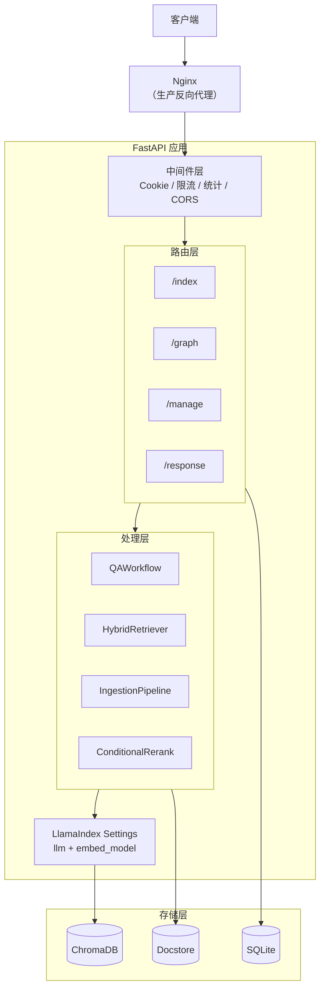
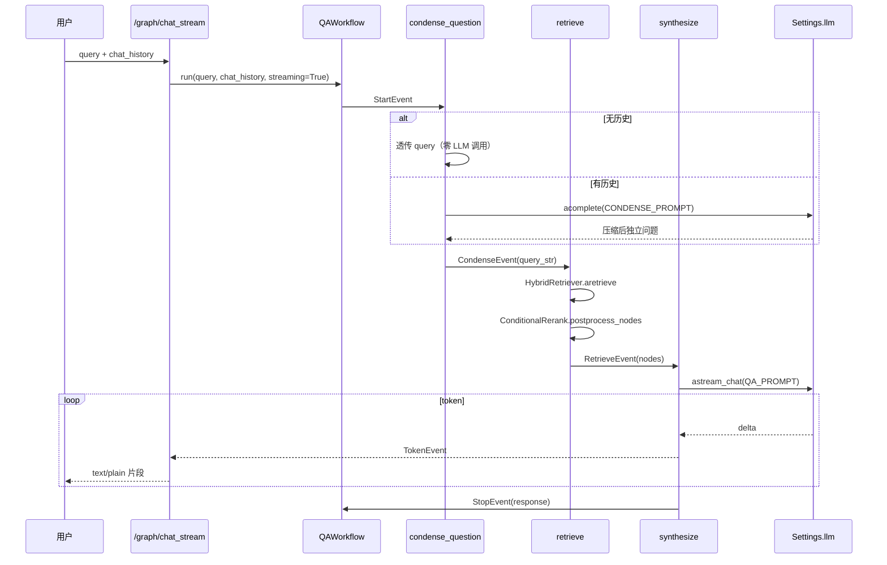
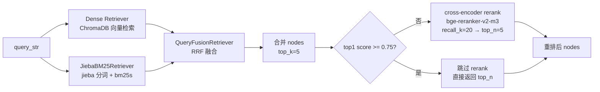

# 架构文档

> CUITCCA 系统架构、模块职责、数据流与关键设计决策的详细说明。与 [README](../README.md) 呼应但更深入。

## 目录

- [系统架构总览](#系统架构总览)
- [模块职责矩阵](#模块职责矩阵)
- [数据流详解](#数据流详解)
- [关键设计决策](#关键设计决策)
- [性能特性](#性能特性)
- [安全架构](#安全架构)
- [可观测性](#可观测性)

---

## 系统架构总览

CUITCCA 采用分层架构，从外到内依次为：客户端 → 中ginx 反向代理（生产）→ FastAPI 中间件层 → 路由层 → 处理层（Handlers）→ LlamaIndex 抽象层 → 存储层（ChromaDB + SQLite + Docstore）。

### 分层职责

1. **中间件层**（`main.py`）：会话 Cookie 管理、速率限制（30 req/60s/IP）、访问统计（异步锁 + 定期刷盘）、CORS 白名单。生命周期由 FastAPI lifespan 管理，启动时加载索引、初始化可观测性，停止时刷盘统计数据。

2. **路由层**（`router/`）：四个路由组（`/index`、`/graph`、`/manage`、`/response`），统一挂载 `require_api_key_if_configured` 依赖。`/manage` 组使用更严格的 `require_configured_api_key`（未配置直接 503）。

3. **处理层**（`handlers/`）：核心业务逻辑。`QAWorkflow` 负责三步问答，`HybridRetriever` 负责混合检索，`IngestionPipeline` 负责增量摄取，`ConditionalRerankPostprocessor` 负责条件重排。

4. **LlamaIndex 抽象层**：`Settings.llm`（OpenAILike）与 `Settings.embed_model`（bge-m3）为全局单例，由 `configs/llm_predictor.py` 初始化。

5. **存储层**：ChromaDB（向量存储与检索）、SQLite（访问统计与用户反馈）、SimpleDocumentStore（增量摄取的 doc_id → content hash 去重记忆）。

### 架构图


---

## 模块职责矩阵

| 模块 | 职责 | 输入 | 输出 | 依赖 |
|------|------|------|------|------|
| `main.py` | 应用入口、lifespan、中间件注册 | FastAPI app | 挂载路由、初始化存储 | router/*, configs/*, handlers/* |
| `router/index.py` | 索引 CRUD、文档上传、节点编辑 | HTTP 请求 | JSON 响应 | handlers/index_crud, utils/file, utils/upload |
| `router/graph.py` | 查询、流式聊天、WebSocket、会话管理 | HTTP/WS 请求 | JSON/SSE/WS 响应 | handlers/qa_workflow, utils/security |
| `router/manage.py` | 访问统计、用户反馈、env 只读 | HTTP 请求（需 API Key） | JSON 响应 | utils/db, utils/file, utils/security |
| `router/response.py` | 自定义响应模式合成 | HTTP 请求 | JSON 响应 | handlers/llama_handler, llama_index |
| `handlers/qa_workflow.py` | 三步问答（condense→retrieve→synthesize） | query, chat_history | response, source_nodes, token stream | handlers/hybrid_retriever, configs/config, llama_index |
| `handlers/hybrid_retriever.py` | BM25+dense RRF 混合检索 | index_id, query | NodeWithScore 列表 | bm25s, jieba, chromadb, llama_index |
| `handlers/ingestion_pipeline.py` | 增量摄取（sha256 去重、冲突消解） | 文件路径列表 | IngestionRun 结果 | llama_index IngestionPipeline, SimpleDocumentStore |
| `handlers/index_crud.py` | 索引生命周期、节点增删改 | index_id, doc/node 数据 | 索引对象、操作结果 | chromadb, llama_index, utils/file |
| `utils/rerank.py` | 条件触发式 cross-encoder 重排 | nodes 列表 | 重排后 nodes | sentence-transformers, configs/load_env |
| `utils/security.py` | 认证（双层级）、IP 提取 | HTTP 请求 | 鉴权结果/异常 | os, secrets, starlette |
| `utils/file.py` | 文件名安全化、内容读取、反馈存储 | 文件/文本 | 安全文件名/内容 | 无外部依赖 |
| `utils/upload.py` | 上传校验（类型白名单、大小） | UploadFile | 校验结果/异常 | 无外部依赖 |
| `configs/llm_predictor.py` | LLM 与嵌入模型初始化 | 环境变量 | Settings.llm, Settings.embed_model | llama_index, openai |
| `configs/observability.py` | OTel + OpenInference 初始化 | 环境变量 | instrumentation 状态 | opentelemetry, openinference |
| `configs/load_env.py` | 环境变量加载与热重载 | .env 文件 | 配置变量 | python-dotenv |
---

## 数据流详解

### 请求流（通用）

所有请求经过统一的中间件链：

1. **CORS 中间件**：按 `CORS_ORIGINS` 白名单校验 Origin
2. **会话 Cookie**：首次请求生成 `session_id`（`secrets.token_hex`），后续请求读取 Cookie
3. **速率限制**：LLM 查询端点（`/graph/*`）按 IP 限流，30 req/60s，超出返回 429
4. **访问统计**：异步锁保护 `access_stats` 字典，每 60s 刷盘到 SQLite
5. **认证依赖**：`require_api_key_if_configured` 在路由组级别校验 Bearer token

### 问答流（QAWorkflow）

`/graph/chat_stream` 与 `/graph/workflow_query_stream` 的核心链路：



### 检索流（HybridRetriever + 条件重排）



### 上传流（insert_into_index 链路）

1. `validate_upload_file`：校验扩展名白名单（PDF/DOCX/TXT/MD/CSV/XLSX）与大小（200MB）
2. `safe_filename`：去除路径分隔符，防穿越
3. 永久存储到 `SAVE_PATH/{index_id}/`（失败回滚）
4. 临时拷贝到 `LOAD_PATH/{uuid}_{name}`
5. `read_file_contents` → `SimpleDirectoryReader` 解析
6. `SentenceSplitter` 切块 → `Settings.embed_model` 嵌入
7. 写入 ChromaDB collection + docstore
8. `invalidate_hybrid_retriever_cache`：清空 BM25 缓存
9. finally 删除临时文件
---

## 关键设计决策

### 为什么用 QAWorkflow 而非 chat_engine

`router/graph.py` 的 7 个聊天端点已全部迁移到 `QAWorkflow`（基于 `llama_index.core.workflow`），不再使用 `CondenseQuestionChatEngine`/`RouterQueryEngine`。原因有三：（1）Workflow 用显式 `Event` 在 step 间传数据，链路可读、可测试，比 chat_engine 的隐式 `response_gen` 更清晰；（2）流式实现直接调用 `llm.astream_chat()` 拿 token 级异步生成器，通过 `ctx.write_event_to_stream(TokenEvent(...))` 广播，避免 chat_engine 同步/异步生成器分用的坑；（3）`max_retrieval_iterations` 参数为未来 multi-hop 检索留了钩子（当前固定 1 次）。检索选择逻辑（0/1/多索引分支 + `LLMSingleSelector`）与原 `RouterQueryEngine` 完全一致，只是从 QueryEngine 层移到 Retriever 层。

### 为什么用 BM25+dense RRF 而非纯 dense

`evals/run_hybrid_eval.py` 的 A/B/C 对比数据（`campus-corpus`，20 题）：纯向量基线 hit_rate@1 = 75%、MRR@5 = 0.852；加入 BM25（jieba 分词）+ dense RRF 融合后 hit_rate@1 = 85%、MRR@5 = 0.896，延迟仅 +2ms。BM25 对中文专有名词（如"教务处""奖学金"）的精确匹配能力弥补了 dense 检索在术语上的模糊性。不用 `llama_index.retrievers.bm25.BM25Retriever` 是因为其 `tokenizer` 参数在当前版本是废弃且不生效的桩代码，中文会被当成一个 token，BM25 词频匹配直接失效。改用 `bm25s` + jieba 自实现轻量 retriever，分词、建索引、查询全程用 jieba。

### 为什么条件重排而非全量重排

cross-encoder（bge-reranker-v2-m3，约 2.2GB）在 CPU 上每次重排约 660ms。如果每次查询都触发，延迟体验差。`ConditionalRerankPostprocessor` 的策略是：检索结果 top1 分数 >= `RERANK_SCORE_THRESHOLD`（默认 0.75）时跳过 rerank，仅在低置信度时触发。评测数据显示，纯向量 + rerank 可将 hit_rate@1 从 75% 提到 95%（+20pp），但混合检索 + rerank 的组合为 90%（+15pp from 纯向量基线）。条件触发缓解了延迟代价但没有消除——如果后续观测到延迟问题，`RERANK_ENABLED` 可随时关回，不影响混合检索本身。
### 为什么用 require_api_key_if_configured

`utils/security.py` 提供两个认证函数：`require_api_key_if_configured`（用于 `/index`、`/graph`、`/response`）在 `CUITCCA_API_KEY` 未配置时直接跳过认证，配置后强制 Bearer 鉴权；`require_configured_api_key`（用于 `/manage`）在未配置时返回 503。这种双层级设计让本地开发零配置即可联调读写接口（`make dev` 后直接 `curl`），而生产部署只需配置一个环境变量即获得强制鉴权。API Key 校验用 `secrets.compare_digest` 做常量时间比较，防时序侧信道。速率限制只信任 `request.client.host`（直接连接的 IP），不信 `X-Real-IP`/`X-Forwarded-For` 等可伪造 header。

### 为什么增量摄取管道（UPSERTS 去重）

`handlers/ingestion_pipeline.py` 基于 `llama_index.core.ingestion.IngestionPipeline` + `DocstoreStrategy.UPSERTS` 实现增量摄取。文档 id 按内容 sha256 生成（不用文件名，更不用上传时的随机 uuid 前缀），配合 `TextNode.hash`（= sha256(text + str(metadata))）让重复运行天然具备幂等性：内容完全相同 → 同一 doc_id + 同一 hash → 跳过；内容变化 → hash 不同 → 删除旧 node、重新嵌入；全新内容 → 新增。`metadata.last_updated` 用文件 mtime 而非摄取时间，因为 `TextNode.hash` 包含 `str(metadata)`，用摄取时间会导致每次重跑 hash 都变，抵消去重效果。同名冲突（不同来源的 `学校历史.txt`）按"同目录取新 / 跨目录全保留"策略消解，不做随机丢弃。

---

## 性能特性

### 混合检索缓存

`hybrid_retriever.py` 用 `OrderedDict` + `threading.Lock` 实现 LRU 缓存（容量 64），缓存 `build_retriever_for_index()` 的结果（含 BM25 索引构建）。首次查询某索引时构建 BM25 语料（从 ChromaDB get_nodes），后续查询直接命中缓存。文档上传/删除时调用 `invalidate_hybrid_retriever_cache()` 清空全部缓存，保证一致性。

### Settings 单例

`configs/llm_predictor.py` 的 `init_settings()` 在 lifespan 启动时调用一次，将 `Settings.llm`（OpenAILike）和 `Settings.embed_model`（HuggingFace bge-m3）设为全局单例。bge-m3 本地运行，无需 API key，首次启动下载约 2GB 模型文件。

### 流式响应

`QAWorkflow.synthesize` step 直接调用 `llm.astream_chat()` 拿 token 级异步生成器，每个 delta 通过 `ctx.write_event_to_stream(TokenEvent(...))` 广播。`/graph/chat_stream` 端点用 `StreamingResponse`（media_type=`text/plain`）消费 `handler.stream_events()`，实现首字延迟最低的流式体验。WebSocket 端点（`WS /graph/query`）需 API Key（`token` query 参数），用于实时双向场景。
---

## 安全架构

### 认证层级

| 函数 | 适用路由 | 未配置 API Key | 已配置 API Key |
|------|---------|---------------|---------------|
| `require_api_key_if_configured` | `/index`、`/graph`、`/response` | 跳过认证（本地开发友好） | 强制 Bearer 鉴权 |
| `require_configured_api_key` | `/manage` | 返回 503（防止默认部署被任意调用） | 强制 Bearer 鉴权 |

API Key 校验用 `secrets.compare_digest` 做常量时间比较，防时序侧信道攻击。WebSocket 端点通过 `token` query 参数传递 API Key。

### 速率限制

仅对 LLM 查询端点（`/graph/*`）生效，每 IP 每 60 秒最多 30 次请求，超出返回 429。存储用 `defaultdict(list)` + `asyncio.Lock`，lifespan 启动后台任务定期清理过期记录（窗口 60s，存储上限 5000 IP）。

### 输入校验

- **文件上传**：`validate_upload_file` 校验扩展名白名单（PDF/DOCX/TXT/MD/CSV/XLSX）与大小（200MB）
- **路径穿越防护**：`safe_filename` 去除路径分隔符，索引名用 `_sanitize_index_name`（非字母数字替换为 `_`）
- **输入长度**：FastAPI `Form(max_length=...)` 限制查询（5000）、文本（50000）、索引名（100）等
- **XSS 防护**：Markdown 渲染用 `marked.js` + `DOMPurify`，前端不直接 `innerHTML` 原始 LLM 输出

### IP 与 CORS

- `get_client_ip` 只信任 `request.client.host`（直接连接 IP），不信 `X-Real-IP`/`X-Forwarded-For` 等可伪造 header
- `CORS_ORIGINS` 环境变量配置白名单（逗号分隔），默认仅允许 localhost 系列

### `/manage/env` 只读化

原 `POST /manage/env`（在线修改 LLM 配置）已移除，改为 `GET /manage/env` 只读脱敏返回。修改 LLM 配置需直接编辑 `.env` 后重启服务，消除"接口可改 LLM 后端和密钥"的安全风险。

---

## 可观测性

### OTel + OpenInference span 树

`configs/observability.py` 的 `init_observability()` 在 lifespan 启动时调用。用 `openinference-instrumentation-llama_index` 的 `LlamaIndexInstrumentor` 把 LlamaIndex 内部每一步（retrieve、synthesize、LLM 调用、embedding 调用）导出为 OpenTelemetry trace，通过 OTLP HTTP 协议发到任意兼容后端（推荐 [Arize Phoenix](https://phoenix.arize.com/)）。

### 默认关闭、零开销

不设任何环境变量时，`init_observability()` 是纯 no-op：不 import otel 包、不注册任何 handler，只打一条 debug 日志。生产/开发都不会被 tracing 拖慢。

### 开启方式

| 变量 | 作用 |
|------|------|
| `CUITCCA_TRACING_ENABLED=true` | 显式开启，endpoint 未指定时默认发往本地 Phoenix |
| `OTEL_EXPORTER_OTLP_ENDPOINT=<url>` | OTLP HTTP endpoint，设置即视为开启 |
| `OTEL_SERVICE_NAME=<name>` | service.name，默认 `cuitcca` |

### span 树示例

一次检索链路产生的 span 树：

```
VectorIndexRetriever.retrieve                 kind=RETRIEVER   (root)
└─ VectorIndexRetriever._retrieve             kind=RETRIEVER
   └─ HuggingFaceEmbedding.get_query_embedding  kind=EMBEDDING
```

真实问答链路还会看到 `QAWorkflow` 的 CHAIN span、`OpenAILike` 的 LLM span（含完整 prompt/response、token 数）和 `ConditionalRerank` 的 postprocessor span，每个 span 都带 `openinference.span.kind` 属性。详见 [docs/observability.md](observability.md)。